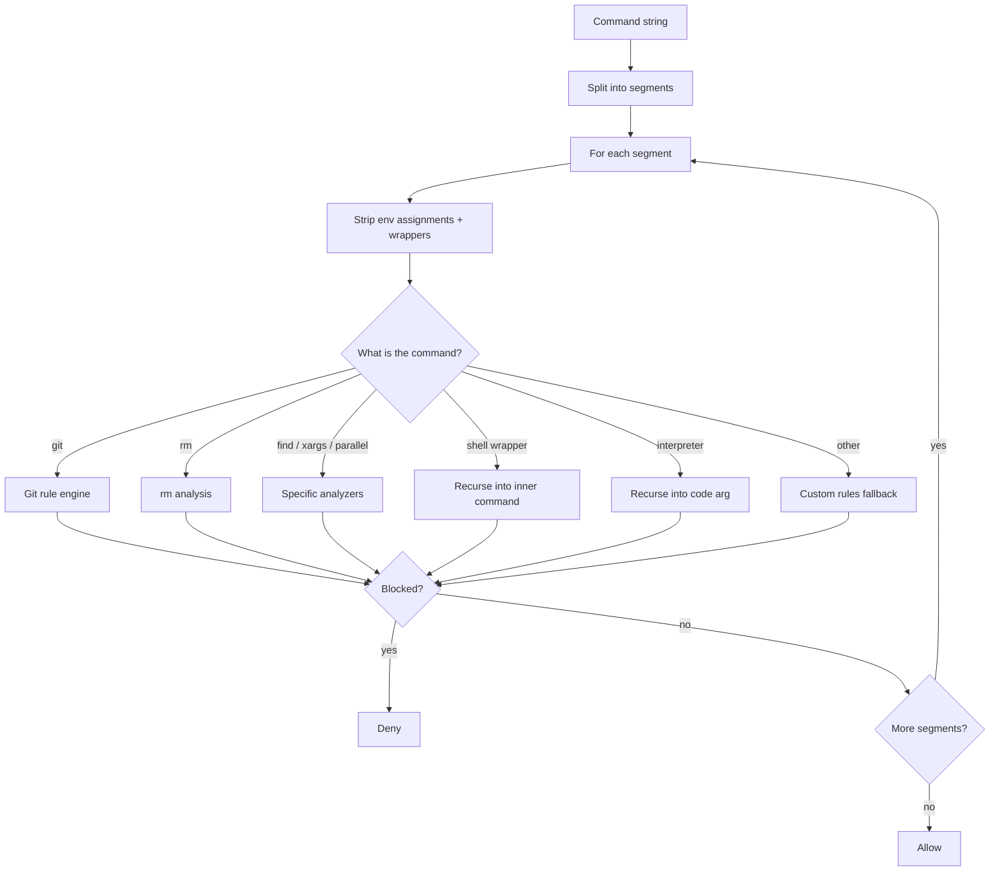

The analysis engine is the platform-agnostic core that decides whether a command is destructive. This page documents how each analyzer inspects a command, so you can understand exactly why a given command is blocked or allowed — useful when reading `explain` output or writing precise [custom rules](/configuration/custom-rules). For the system view, see [Architecture](/guides/architecture).

The engine is fail-closed: when a command cannot be parsed safely, or when config is invalid, the command is denied rather than allowed.

## The pipeline at a glance

A command enters as a single string. The engine splits it into segments by shell operators, then walks each segment through detection and dispatch to the right analyzer. Shell wrappers (`bash -c`) and interpreters (`python -c`) are recursively re-analyzed, with cwd and environment propagated between segments and into nested calls. If any segment is blocked, the whole command is denied.



Recursion is capped at **10 levels deep** to bound the work on deeply nested wrappers and interpreters.

## Shell wrappers and interpreter one-liners

After environment assignments and wrappers are stripped from a segment, the command name is checked against two sets:

- **Shell wrappers** — `bash`, `sh`, `zsh`, `ksh`, `dash`, `fish`, `csh`, `tcsh`. The argument following `-c` is extracted and recursively analyzed.
- **Interpreters** — `python`, `python2`, `python3`, `node`, `ruby`, `perl`. The code argument (after `-c`, or `-e` for node/ruby/perl) is extracted and scanned for embedded destructive operations.

By default the interpreter's code is scanned for embedded destructive commands, so `python -c 'import os; os.system("rm -rf /")'` is blocked because of the embedded `rm -rf /` — the one-liner form alone is allowed. [Paranoid interpreters mode](/configuration/modes#interpreter-one-liners-cc_safety_net_paranoid_interpreters1) blocks every one-liner outright regardless of content.

`busybox` dispatch is handled as a special case: the subcommand is shifted into the command position and re-analyzed. `awk`/`gawk`/`mawk` programs are scanned for `system()` calls and backtick command substitutions.

Cwd is tracked across segments of the same command. A `cd` or `pushd` with a literal target updates the effective cwd for subsequent `rm` and `find` analysis; a `cd` to a dynamic target (containing `$` or a backtick) sets the cwd to unknown, which `rm` analysis treats as having no cwd anchor.

<Note>
  A known limitation: interpreter **long-form flags** (`--eval`, `--execute`, `--require`, and the attached `=value` form) are not recognized in every code path, so the code argument may not always be extracted. See [Known Limitations](/guides/known-limitations#interpreter-long-form-flags).
</Note>

## Git rule engine

The git analyzer extracts the subcommand and its options, matches dangerous option patterns, and returns a reason plus a **classification**: `localDiscard` or `sharedState`. This classification drives [worktree relaxation](#worktree-relaxation).

| Classification | Meaning | Examples |
| --- | --- | --- |
| **localDiscard** | Discards only local working-tree state — a candidate for worktree relaxation | `checkout --`, `restore`, `clean -f`, `reset --hard` (no ref), `switch --force`, `rebase --abort`, `merge --abort` |
| **sharedState** | Affects shared, remote, or recovery state — never relaxed | `push --force`, `branch -D`, `stash drop`/`clear`, `worktree remove --force`, `tag -d`, `reflog delete`, `reset --hard <ref>` |

Option matching handles the real-world grammar of git: long options use prefix matching (so `--forc`, `--force`, and `--force-with-lease` resolve correctly), short options are unbundled (so `-Df` is read as `-D` plus `-f`), and global options that take values (`-c`, `-C`, `--git-dir`, `--work-tree`) are skipped when locating the subcommand. See [Commands Blocked](/reference/blocked-commands) for the full list of blocked git patterns.

<AccordionGroup>
  <Accordion title="Git SSH environment overrides">
    Git accepts `GIT_SSH_COMMAND`, `GIT_SSH`, and `GIT_SSH_VARIANT` to run an arbitrary program during network operations. CC Safety Net blocks any of these overrides when combined with a network subcommand (`clone`, `fetch`, `pull`, `push`, `ls-remote`, `submodule`), because they can execute arbitrary commands during a network operation.
  </Accordion>
  <Accordion title="checkout specifics">
    `checkout` analysis checks, in order: force (`--force`/`-f`); new-branch escape (`-b`/`-B`/`--orphan` returns no block); `--pathspec-from-file`; double-dash pathspec (`git checkout --` discards uncommitted changes; `git checkout <ref> -- <path>` overwrites the working tree with the ref version); and ambiguous multi-positional forms (two or more positionals suggests using `switch`/`restore` instead).
  </Accordion>
  <Accordion title="reset classification">
    `reset --hard`/`--merge` is classified `sharedState` when a ref precedes `--` (it moves a branch pointer), and `localDiscard` otherwise (it only discards working-tree changes).
  </Accordion>
</AccordionGroup>

## rm analysis

`rm` analysis detects recursive+force flags, extracts targets, and classifies each target against the current working directory. Targets are checked in this order — the first match wins:

| # | Classification | What it matches | Outcome |
| --- | --- | --- | --- |
| 1 | **root/home target** | `/`, `/*`, `~`, `~/`, `$HOME`, `${HOME}` and their children | Always blocked |
| 2 | **temp target** | `/tmp`, `/var/tmp`, the system temp dir, `$TMPDIR` (unless overridden to a non-temp path) | Allowed |
| 3 | **dynamic target** | Any target containing `$` or a backtick — expansion cannot be predicted | Blocked |
| 4 | **home-cwd target** | The cwd _is_ the home directory (suggests moving into a project dir first) | Blocked |
| 5 | **cwd self-target** | `.`, `./`, or any target that resolves to the same inode as the cwd | Blocked |
| 6 | **within-cwd target** | A path that resolves inside the current working directory | Allowed by default; blocked under [paranoid rm](/configuration/modes#rm-check-cc_safety_net_paranoid_rm1) |
| 7 | **outside-cwd target** | Anything else (absolute, parent, or non-temp paths outside the cwd) | Blocked |

Both recursive (`-r`/`-R`/`--recursive`) and force (`-f`/`--force`) flags must be present for this classification to run. Path comparison uses canonical (realpath) resolution, so a symlink to `/` is correctly classified as dangerous, and `/tmp-malicious` does not match the `/tmp` temp rule.

<Note>
  The important distinction for everyday use: `rm -rf ./subdir` (within cwd) is **allowed**, but `rm -rf .` (the cwd itself) is **blocked**. See [Commands Allowed](/reference/allowed-commands).
</Note>

## find, xargs, and parallel

| Command | What is blocked |
| --- | --- |
| `find ... -delete` | Permanent removal via the find primary (use `-print` to preview) |
| `find -exec rm -rf ...` | The exec command is re-analyzed as a nested segment, so a destructive exec is blocked |
| `xargs rm -rf` | rm driven by piped, dynamic input — targets are unpredictable |
| `xargs <shell> -c` | Shell execution from dynamic input |
| `parallel rm -rf` | rm driven by parallel placeholders or stdin |
| `parallel <shell> -c` | Shell execution from dynamic input |

For `xargs` and `parallel`, the concern is that the targets come from dynamic input (piped stdin or placeholder expansion), so they cannot be verified against the cwd. SSH-remote mode in `parallel` (`-S`/`--sshlogin`) also disables worktree relaxation.

## Worktree relaxation

When [worktree mode](/configuration/modes#worktree-mode-cc_safety_net_worktree1) is active, local-discard git commands are allowed inside a confirmed linked worktree. Relaxation requires all of the following:

1. The matched rule is classified `localDiscard` (see the [git rule engine](#git-rule-engine) table). `sharedState` rules never relax.
2. `CC_SAFETY_NET_WORKTREE=1` is set.
3. No git context environment override is present (`GIT_DIR`, `GIT_WORK_TREE`, `GIT_COMMON_DIR`, `GIT_INDEX_FILE`), and no `--git-dir`/`--work-tree` on the command line.

A linked worktree is positively verified — not just assumed. The check confirms the `.git` entry is a _file_ (not a directory or symlink) whose `gitdir:` pointer resolves to a directory containing a `commondir` file, that the backlink points back to this worktree, and that `config.worktree` matches. Main worktrees, bare repos, and submodules are not relaxed. If verification fails for any reason, the command stays blocked (fail-closed).

<AccordionGroup>
  <Accordion title="Non-relaxable local discards">
    Even inside a confirmed linked worktree, these are never relaxed: dynamic arguments containing `$`, `*`, `?`, or `[`; forced branch resets (`git checkout -B`/`-Bf` or `git switch -C`/`-Cf` with `-f` or `--discard-changes`); `git clean` with more than one `-f` flag (needed to remove nested git repos, which crosses the disposable-worktree boundary); and any `--recurse-submodules` option or recursive-submodule config.
  </Accordion>
  <Accordion title="git -C path resolution">
    The effective git working directory is resolved by walking leading global options. `-C <path>` and inline `-C<path>` apply a directory change. `--git-dir`/`--work-tree` (separate or `=` forms) mark an explicit git context, which disables relaxation entirely.
  </Accordion>
</AccordionGroup>

## Custom rules

When no built-in analyzer matches, custom rules run as a fallback. They are strictly additive — they can only add blocks, never override a built-in block or relax protection. Rules are namespaced as `<rulebook-name>/<rule-name>` and matched on the command basename, an optional subcommand, and literal `block_args` (with short-option unbundling, so `-Ap` matches `-A`).

See [Custom Rules](/configuration/custom-rules) for the full authoring guide and matching semantics.

## Tracing a decision

To see exactly how the engine evaluated a specific command, run `explain`:

```bash
npx cc-safety-net explain "rm -rf ./build"
npx cc-safety-net explain --json "git checkout -- file.txt"
```

The human-readable output walks through each segment, showing parse steps and rule evaluations. The JSON output returns the structured trace — see the [Explain trace reference](/reference/explain-trace) for the schema.
