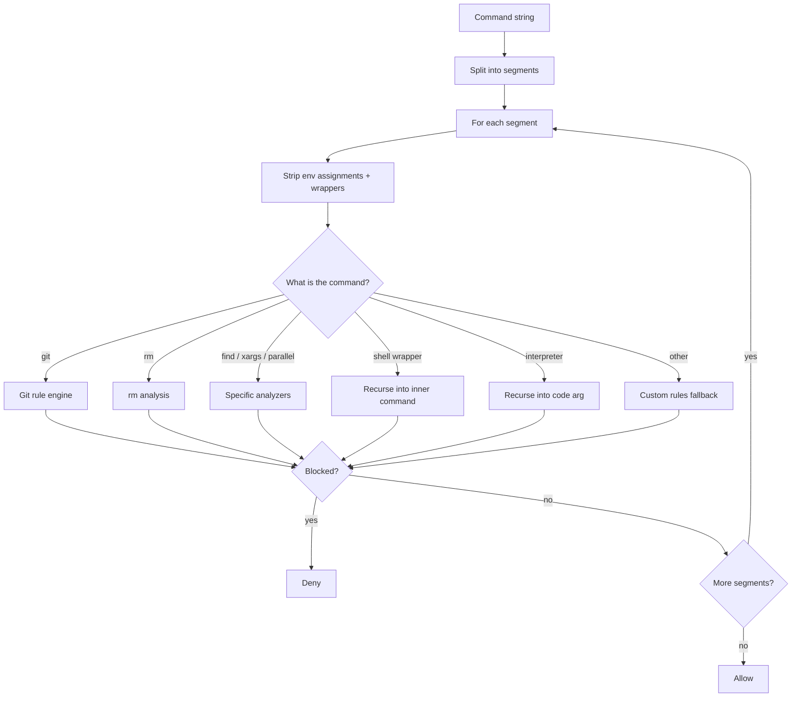

The analysis engine is the platform-agnostic classifier that decides whether a command is destructive. This page documents how each analyzer inspects a command, so you can understand exactly why a given command is blocked or allowed — useful when reading `explain` output or writing precise [custom rules](/configuration/custom-rules). For the system view, see [Architecture](/guides/architecture).

## Where the classifier sits

Command analysis is the **last** stage of the guard, not the first. By the time a command reaches the classifier, the tool input has already passed bounded extraction, the parser budgets have already been checked, and three protections have already had their say:

1. **Policy-file protection** and **Git-metadata protection** ran *before* any configuration was loaded, so they cannot be weakened by policy.
2. The **policy snapshot** was loaded and the effective safety level resolved.
3. **Sensitive-path protection** inspected the command, path, search, and patch shapes for built-in sensitive paths and configured deny paths.

Only after all of that does the classifier described on this page run. The full ordered stage table is in [Architecture](/guides/architecture#the-ordered-guard-stages).

Two fail-closed behaviours belong to the guard rather than to the classifier, and they apply **in every safety level**:

- Exceeding a **tool-input bound** (traversal depth, node count, key count, per-string or aggregate size) denies.
- Exceeding a **parser budget** — 131,072 UTF-16 code units, 16,384 words, or 64 nesting levels — denies.

Invalid *configuration* is a different case entirely. A rejected configuration source is dropped and the runtime reports a `degraded` state; it never turns ordinary work into a denial. See [Configuration Recovery](/configuration/recovery).

## Safety-level boundaries

The three safety levels are presets over three capabilities. Getting these boundaries right is the difference between predicting a block and being surprised by one.

| Level | Fail closed | Paranoid `rm` | Paranoid interpreters |
| --- | --- | --- | --- |
| `standard` | off | off | off |
| `strict` | **on** | off | off |
| `paranoid` | **on** | **on** | **on** |

Any capability mix that is not exactly one of the three presets reports as the effective level `custom`.

### Standard

Standard blocks recognisable destructive commands. It is deliberately **not** adversarial-grade, and it is best-effort against dynamic or hostile input.

- **Safe-looking unparseable text is permitted.** `echo 'unterminated` is allowed.
- **Recognisable destructive text is still blocked, even when unparseable.** `git reset --hard 'unterminated` blocks via the raw-text heuristic scan, which recognises `rm -rf`, `git reset --hard`/`--merge`, `git clean -f`, `git checkout --force`, `git push --force`/`--delete`, `git branch -D`, `git tag -d`, `git stash drop`/`clear`, `git checkout --`, `git restore`, `find -delete`, `dd of=/dev/`, `mkfs /dev/`, and `shred <arg>`.
- **Dynamic `rm -rf` targets are not categorically blocked.** `rm -rf "$target"` is allowed in standard; it blocks only once the fail-closed capability is on.
- Standard also intentionally allows dynamic executables, guarded command structure assembled through substitution, other unverifiable recursive-delete targets, and standalone metadata-only checks of built-in sensitive paths.
- Standard never relaxes **sensitive content access** or **configured deny paths**, and never relaxes the catastrophic protections.

### Strict

[Strict mode](/configuration/modes#strict-mode-cc_safety_net_strict=1) turns on the fail-closed capability. It does considerably more than tighten the unparseable case.

- **Unparseable commands are blocked.** `echo 'unterminated` denies with a reason stating the command could not be safely analyzed.
- **Metadata-only sensitive-path discovery is blocked.** `test -f ~/.ssh/id_rsa` and `find ~/.ssh -type f` are allowed in standard and blocked in strict.
- The standard-only relaxation that treats sensitive path literals inside Node and Bun inline evaluation as inert diagnostic data is disabled.
- **Unverifiable destructive targets are blocked.** Five rules are gated on the fail-closed capability, so they are allowed in standard and blocked in strict:

| Rule id | Example | Intent |
| --- | --- | --- |
| `rm.recursive-force-dynamic-target` | `rm -rf "$target"` | `scope_down` |
| `powershell.remove-item-recursive-force-dynamic-target` | `Remove-Item $target -Recurse -Force` | `scope_down` |
| `powershell.remove-item-pipeline-dynamic-target` | `Get-ChildItem . -Recurse \| Remove-Item -Force` | `scope_down` |
| `shell.dynamic-executable` | `$(printf r)m -rf /` | `manual_only` |
| `shell.dynamic-structure` | `git reset $(printf --hard)` | `stop_and_explain` |

Individual strict-tier rules can be turned off, but **strict is still strict** for fail-closed outcomes that have no registered destructive-command rule id — parser fail-closed and sensitive-path outcomes among them.

### Paranoid

[Paranoid mode](/configuration/modes#paranoid-mode-cc_safety_net_paranoid=1) is strict plus two capabilities.

- [Paranoid `rm`](/configuration/modes#rm-check-cc_safety_net_paranoid_rm=1) blocks non-temp recursive forced removal even *inside* the current working directory — `rm -rf ./cache` and `Remove-Item ./cache -Recurse -Force` both block. Temp targets and configured allow paths remain allowed.
- [Paranoid interpreters](/configuration/modes#interpreter-one-liners-cc_safety_net_paranoid_interpreters=1) blocks every interpreter one-liner regardless of content, including `python -c "print(1)"`.

### Per-rule overrides versus levels

For non-catastrophic rules, precedence is: the master switch `destructive_command_protection` first, then the per-rule `"on"` / `"off"` override, then the resolved preset capability. Any strict- or paranoid-tier rule can be force-enabled under standard with an `"on"` override.

**Catastrophic rules ignore both the master switch and any `"off"` override.** They are `rm.recursive-force-root-or-home`, `rm.git-metadata`, `powershell.remove-item-root-or-home`, `powershell.remove-item-recursive-force-root-or-home`, `powershell.remove-item-git-metadata`, and `find.delete-git-metadata`, alongside the always-on policy-file guard.

## The classifier pipeline at a glance

A command enters as a single string. The engine splits it into segments by shell operators, then walks each segment through detection and dispatch to the right analyzer. Shell wrappers (`bash -c`) and interpreters (`python -c`) are recursively re-analyzed, with cwd and environment propagated between segments and into nested calls. If any segment is blocked, the whole command is denied.


```mermaid
graph TD
    Input["Command string"] --> Split["Split into segments"]
    Split --> Loop["For each segment"]
    Loop --> Strip["Strip env assignments + wrappers"]
    Strip --> Head{"What is the command?"}
    Head -->|git| Git["Git rule engine"]
    Head -->|rm| Rm["rm analysis"]
    Head -->|find / xargs / parallel| Other["Specific analyzers"]
    Head -->|shell wrapper| Recurse1["Recurse into inner command"]
    Head -->|interpreter| Recurse2["Recurse into code arg"]
    Head -->|other| Custom["Custom rules fallback"]
    Git --> Decision{"Blocked?"}
    Rm --> Decision
    Other --> Decision
    Recurse1 --> Decision
    Recurse2 --> Decision
    Custom --> Decision
    Decision -->|yes| Deny["Deny"]
    Decision -->|no| Next{"More segments?"}
    Next -->|yes| Loop
    Next -->|no| Allow["Allow"]
```

Recursion is capped at **10 levels deep** to bound the work on deeply nested wrappers and interpreters.

## Shell wrappers and interpreter one-liners

After environment assignments and wrappers are stripped from a segment, the command name is checked against two sets:

- **Shell wrappers** — `bash`, `sh`, `zsh`, `ksh`, `dash`, `fish`, `csh`, `tcsh`. The argument following `-c` is extracted and recursively analyzed.
- **Interpreters** — `python`, `python2`, `python3`, `node`, `ruby`, `perl`. The code argument (after `-c`, or `-e` for node/ruby/perl) is extracted and scanned for embedded destructive operations.

By default the interpreter's code is scanned for embedded destructive commands, so `python -c 'import os; os.system("rm -rf /")'` is blocked because of the embedded `rm -rf /` — the one-liner form alone is allowed. [Paranoid interpreters mode](/configuration/modes#interpreter-one-liners-cc_safety_net_paranoid_interpreters=1) blocks every one-liner outright regardless of content.

`busybox` dispatch is handled as a special case: the subcommand is shifted into the command position and re-analyzed. `awk`/`gawk`/`mawk` programs are scanned for `system()` calls and backtick command substitutions.

### Transparent wrappers

Standard wrappers (`sudo`, `env`, `command`, `builtin`) are always stripped. Beyond those, you can declare your own proxy commands as **transparent wrappers**, so the engine unwraps them and analyzes the real child command:

```bash
npx cc-safety-net rule wrapper add rtk
npx cc-safety-net rule wrapper list
npx cc-safety-net rule wrapper remove rtk
```

There are **no built-in defaults** — configure only wrappers you intentionally trust. Each entry must match the command pattern, must be unique, and must not be a reserved command (`git`, `busybox`, the built-in analyzed commands `rm`, `find`, `xargs`, `parallel`, every shell wrapper, every interpreter, and the awk interpreters). User- and project-scope lists are merged.

Unwrapping finds the first *protectable* child command after wrapper flags and environment assignments, or the token right after an explicit `--`. Once unwrapped, both built-in analysis and **custom rules** apply to the child: `rtk git reset --hard` blocks on the built-in rule, and `rtk docker system prune` hits a matching custom rule. Child commands that nothing protects are not unwrapped.

A proxy that is *not* listed in `transparent_wrappers`, or one that rewrites or hides its child command rather than exec'ing a visible child, is still not unwrapped — only the top-level dangerous-text fallback scan may catch it.

Cwd is tracked across segments of the same command. A `cd` or `pushd` with a literal target updates the effective cwd for subsequent `rm` and `find` analysis; a `cd` to a dynamic target (containing `$` or a backtick) sets the cwd to unknown, which `rm` analysis treats as having no cwd anchor.

<Note>
  A known limitation: interpreter **long-form flags** (`--eval`, `--execute`, `--require`, and the attached `=value` form) are not recognized in every code path, so the code argument may not always be extracted. See [Known Limitations](/guides/known-limitations#interpreter-long-form-flags).
</Note>

## Git rule engine

The git analyzer extracts the subcommand and its options, matches dangerous option patterns, and returns a reason plus a **classification**: `localDiscard` or `sharedState`. This classification drives [worktree relaxation](#worktree-relaxation).

| Classification | Meaning | Examples |
| --- | --- | --- |
| **localDiscard** | Discards only local working-tree state — a candidate for worktree relaxation | `checkout --`, `restore`, `clean -f`, `reset --hard` (no ref), `switch --force`, `rebase --abort`, `merge --abort` |
| **sharedState** | Affects shared, remote, or recovery state — never relaxed | `push --force`, `branch -D`, `stash drop`/`clear`, `worktree remove --force`, `tag -d`, `reflog delete`, `reset --hard <ref>` |

Option matching handles the real-world grammar of git: long options use prefix matching (so `--forc`, `--force`, and `--force-with-lease` resolve correctly), short options are unbundled (so `-Df` is read as `-D` plus `-f`), and global options that take values (`-c`, `-C`, `--git-dir`, `--work-tree`) are skipped when locating the subcommand. See [Commands Blocked](/reference/blocked-commands) for the full list of blocked git patterns.

<AccordionGroup>
  <Accordion title="Git SSH environment overrides">
    Git accepts `GIT_SSH_COMMAND`, `GIT_SSH`, and `GIT_SSH_VARIANT` to run an arbitrary program during network operations. CC Safety Net blocks any of these overrides when combined with a network subcommand (`clone`, `fetch`, `pull`, `push`, `ls-remote`, `submodule`), because they can execute arbitrary commands during a network operation.
  </Accordion>
  <Accordion title="checkout specifics">
    `checkout` analysis checks, in order: force (`--force`/`-f`); new-branch escape (`-b`/`-B`/`--orphan` returns no block); `--pathspec-from-file`; double-dash pathspec (`git checkout --` discards uncommitted changes; `git checkout <ref> -- <path>` overwrites the working tree with the ref version); and ambiguous multi-positional forms (two or more positionals suggests using `switch`/`restore` instead).
  </Accordion>
  <Accordion title="reset classification">
    `reset --hard`/`--merge` is classified `sharedState` when a ref precedes `--` (it moves a branch pointer), and `localDiscard` otherwise (it only discards working-tree changes).
  </Accordion>
</AccordionGroup>

## Recursive-delete target classification

`rm` analysis detects recursive plus force flags, extracts targets, and classifies each target against the current working directory. Targets are checked in this order — **the first match wins**, and the order itself is load-bearing:

| # | Classification | What it matches | Outcome |
| --- | --- | --- | --- |
| 1 | **unsafe `$TMPDIR` word-splitting** | An unquoted `$TMPDIR` that could split into multiple words | Blocked (treated as outside the cwd) |
| 2 | **unsupported Windows namespace** | UNC and device-namespace paths the classifier cannot anchor | Blocked (treated as outside the cwd) |
| 3 | **root/home target** | `/`, `/*`, `~`, `~/`, `$HOME`, `${HOME}` and their children, literal or canonicalized | Always blocked — catastrophic |
| 4 | **protected Git metadata** | The resolved `.git` entry, its directories, or its hooks directories | Always blocked — catastrophic |
| 5 | **temp target** | `/tmp`, `/var/tmp`, the system temp dir, `$TMPDIR` (unless overridden to a non-temp path) | Allowed |
| 6 | **dynamic target** | Any target whose expansion cannot be predicted | Allowed in standard; blocked once [strict](/configuration/modes#strict-mode-cc_safety_net_strict=1) turns on the fail-closed capability |
| 7 | **configured allow path** | A literal, verified target under `destructive_command_protection.allow_paths` | Allowed (classified as temp) |
| 8 | **home-cwd target** | The cwd _is_ the home directory (move into a project directory first) | Blocked |
| 9 | **cwd self-target** | `.`, `./`, or any target that resolves to the same inode as the cwd | Blocked |
| 10 | **within-cwd target** | A path that resolves inside the current working directory | Allowed; blocked under [paranoid rm](/configuration/modes#rm-check-cc_safety_net_paranoid_rm=1) |
| 11 | **outside-cwd target** | Anything else (absolute, parent, or non-temp paths outside the cwd) | Blocked |

Two consequences of the ordering are worth stating explicitly:

- Step 4 precedes step 7, so **an allow path that contains a repository does not relax Git-metadata protection**.
- Step 6 precedes step 7, so **allow paths never apply to dynamic or otherwise unverifiable targets**.

Allow paths must be absolute or `~/`-prefixed directories. They apply in **every** safety level to `rm`, `Remove-Item`, and `find -delete`. They never relax secret protection, deny paths, root, home, or protected Git metadata. Entries equal to or containing `$HOME` are rejected at validation and again after canonicalization; symlink escapes are not covered.

Both recursive (`-r`/`-R`/`--recursive`) and force (`-f`/`--force`) flags must be present for this classification to run. Path comparison uses canonical (realpath) resolution, so a symlink to `/` is correctly classified as dangerous, and `/tmp-malicious` does not match the `/tmp` temp rule.

<Note>
  The important distinction for everyday use: `rm -rf ./subdir` (within cwd) is **allowed**, but `rm -rf .` (the cwd itself) is **blocked**. See [Commands Allowed](/reference/allowed-commands).
</Note>

### PowerShell `Remove-Item`

`Remove-Item` and its aliases use the same target taxonomy as `rm`, through a conservative PowerShell subset that preserves native quoting, path separators, connectors, pipelines, and dynamic-word provenance.

- `-WhatIf`, `-WhatIf:$true`, and the `-wi` abbreviation neutralise an otherwise-blocked removal; an explicit `-WhatIf:$false` blocks again.
- Dynamic forms are strict-only: `Remove-Item $target -Recurse -Force`, a `Get-ChildItem … | Remove-Item -Force` pipeline, a `-Path` with no value, and splatting (`Remove-Item @params -Recurse -Force`) are all allowed in standard and blocked in strict. The exception is `Remove-Item $HOME -Recurse -Force`, which blocks in **standard** because it classifies as a root/home target rather than a dynamic one.
- Aliases and abbreviated parameters resolve, so `ri . -r -fo` blocks. Invocation-operator forms (`& Remove-Item …`, `& { … }`, `. { … }`) are analyzed, as are `Invoke-Expression` with a literal string and `$(…)` subexpressions.
- `#` line comments and `<# … #>` block comments (including nested ones) are ignored, but real commands after them still block. Malformed or depth-limited block comments and subexpressions fail closed.
- PowerShell wildcards **do** match dot-entries, unlike a POSIX `*` glob. That is why `Remove-Item .git -Recurse -Force` and a PowerShell wildcard at a repository root both hit Git-metadata protection, while POSIX `./*` does not cover `.git`.
- Shell selection matters: the `posix` dialect deliberately does not apply the PowerShell removal rules, while `auto` detects an explicit `Remove-Item` and still keeps cross-shell rules such as `git.reset-hard` in force.

### Device and disk destruction

| Command | Trigger | Rule id | Intent |
| --- | --- | --- | --- |
| `dd` | An operand matching `of=/dev/…` — a direct write to a device path. Reading from a device is not itself the trigger. | `dd.device-write` | `manual_only` |
| `mkfs` | Head is `mkfs` or any `mkfs.*` variant and some operand starts with `/dev/` | `mkfs.device` | `manual_only` |
| `shred` | **Any** target, including `shred --help` and `shred --version` | `shred.target` | `use_alternative` |

All three also appear in the unparseable-text heuristic scan, so `dd of=/dev/…`, `mkfs /dev/…`, and `shred <arg>` inside otherwise unparseable text block as `raw-text.dangerous-command` — except when the text starts with `echo ` or `rg `. None of the three is catastrophic, so they follow the master-switch and per-rule-override precedence.

## find, xargs, and parallel

| Command | What is blocked |
| --- | --- |
| `find ... -delete` | Permanent removal via the find primary (use `-print` to preview) |
| `find -exec rm -rf ...` | The exec command is re-analyzed as a nested segment, so a destructive exec is blocked |
| `xargs rm -rf` | rm driven by piped, dynamic input — targets are unpredictable |
| `xargs <shell> -c` | Shell execution from dynamic input |
| `parallel rm -rf` | rm driven by parallel placeholders or stdin |
| `parallel <shell> -c` | Shell execution from dynamic input |

For `xargs` and `parallel`, the concern is that the targets come from dynamic input (piped stdin or placeholder expansion), so they cannot be verified against the cwd. SSH-remote mode in `parallel` (`-S`/`--sshlogin`) also disables worktree relaxation.

## Worktree relaxation

When [worktree mode](/configuration/modes#worktree-mode-cc_safety_net_worktree=1) is active, local-discard git commands are allowed inside a confirmed linked worktree. Relaxation requires all of the following:

1. The matched rule is classified `localDiscard` (see the [git rule engine](#git-rule-engine) table). `sharedState` rules never relax.
2. Worktree mode is on — `workflow.worktree_mode` in `policy.json` or `CC_SAFETY_NET_WORKTREE=1`, combined as a logical OR.
3. No git context environment override is present (`GIT_DIR`, `GIT_WORK_TREE`, `GIT_COMMON_DIR`, `GIT_INDEX_FILE`), and no `--git-dir`/`--work-tree` on the command line.

A linked worktree is positively verified — not just assumed. The check confirms the `.git` entry is a _file_ (not a directory or symlink) whose `gitdir:` pointer resolves to a directory containing a `commondir` file, that the backlink points back to this worktree, and that `config.worktree` matches. Main worktrees, bare repos, and submodules are not relaxed. If verification fails for any reason, the command stays blocked (fail-closed).

<AccordionGroup>
  <Accordion title="Non-relaxable local discards">
    Even inside a confirmed linked worktree, these are never relaxed: dynamic arguments containing `$`, `*`, `?`, or `[`; forced branch resets (`git checkout -B`/`-Bf` or `git switch -C`/`-Cf` with `-f` or `--discard-changes`); `git clean` with more than one `-f` flag (needed to remove nested git repos, which crosses the disposable-worktree boundary); and any `--recurse-submodules` option or recursive-submodule config.
  </Accordion>
  <Accordion title="git -C path resolution">
    The effective git working directory is resolved by walking leading global options. `-C <path>` and inline `-C<path>` apply a directory change. `--git-dir`/`--work-tree` (separate or `=` forms) mark an explicit git context, which disables relaxation entirely.
  </Accordion>
</AccordionGroup>

## Custom rules

When no built-in analyzer matches, custom rules run as a fallback. They are strictly additive — they can only add blocks, never override a built-in block or relax protection. Rules are namespaced as `<rulebook-name>/<rule-name>` and matched on the command basename, an optional subcommand, and literal `block_args` (with short-option unbundling, so `-Ap` matches `-A`).

See [Custom Rules](/configuration/custom-rules) for the full authoring guide and matching semantics.

## Tracing a decision

To see exactly how the engine evaluated a specific command, run `explain`:

```bash
npx cc-safety-net explain "rm -rf ./build"
npx cc-safety-net explain --json "git checkout -- file.txt"
```

The human-readable output walks through each segment, showing parse steps and rule evaluations. The JSON output returns the structured trace — see the [Explain trace reference](/reference/explain-trace) for the schema.

If a decision looks wrong for your configuration rather than for the command, check whether the runtime is enforcing a fallback policy: `npx cc-safety-net status` prints `ready` or `degraded`, and [Configuration Recovery](/configuration/recovery) explains how to repair the named source.

## Related pages

- [Architecture](/guides/architecture) — the ordered guard stages this classifier is the last part of.
- [Safety Modes](/configuration/modes) — how to select a level and the individual capability toggles.
- [Commands Blocked](/reference/blocked-commands) and [Commands Allowed](/reference/allowed-commands) — the outcome reference.
- [Configuration Recovery](/configuration/recovery) — `ready` versus `degraded`, and the repair path.
- [Known Limitations](/guides/known-limitations) — what the classifier does not see.
