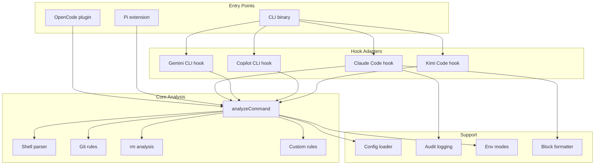
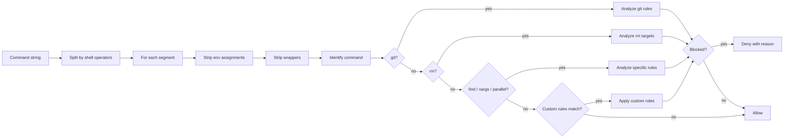

CC Safety Net has three entry points that all share a common analysis engine. The entry points differ only in how they receive commands — stdin JSON for hooks, in-process events for plugins and extensions — but the core analysis is identical. This page gives the system view; for the step-by-step pipeline, see [Analysis Engine](/guides/analysis-engine).

## System components

The CLI binary is what each hook agent invokes (via `cc-safety-net hook <flag>`); it dispatches to the platform-specific adapter. The OpenCode plugin and Pi extension skip the subprocess and call the analysis engine directly from inside the agent's process. See [Integration Architecture](/guides/integration-architecture) for which agent uses which model.

## Entry points

| Entry point | How it receives commands |
| --- | --- |
| CLI binary | stdin JSON from hook systems (Claude Code, Gemini CLI, Copilot CLI, Kimi Code) |
| OpenCode plugin | `tool.execute.before` event, in-process |
| Pi extension | `tool_call` event, in-process |

The CLI binary dispatches to platform-specific hook adapters that parse the platform's JSON format, extract the command, run analysis, and produce the platform-specific deny output. The analysis engine itself knows nothing about which agent issued the command.

## Analysis pipeline

When a command arrives, the engine follows this flow:

The pipeline splits commands by shell operators (`&&`, `||`, `|`, `;`, etc.) into segments, then analyzes each segment independently. If any segment is blocked, the entire command is denied. The engine tracks cwd changes across segments (via `cd`/`pushd`) and propagates environment assignments, so analysis reflects what a real shell would do.

## Key design properties

- **Fail-closed** — when analysis throws or config is invalid, commands are blocked rather than allowed. See [Security Model](/guides/security-model).
- **Recursive analysis** — shell wrappers (`bash -c`) and interpreters (`python -c`) are recursively analyzed up to 10 levels deep.
- **Platform-agnostic core** — the analysis engine knows nothing about specific AI assistant platforms; adapters translate each platform's format.
- **Single runtime dependency** — only `shell-quote` for command tokenization. See [Design Principles](/guides/design-principles#a-single-runtime-dependency).

## Related pages

- [Analysis Engine](/guides/analysis-engine) — the deep dive on each analyzer and the rm classification hierarchy.
- [Integration Architecture](/guides/integration-architecture) — how each agent plugs in.
- [How It Works](/guides/how-it-works) — a narrative walkthrough of interception and blocking.
