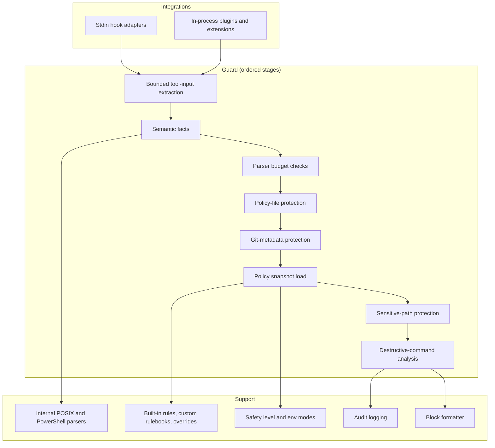
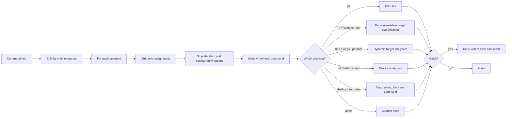

This page is the maintainer-level specification of the guard pipeline. [How it works](/guides/how-it-works) gives the user view. [Integration architecture](/guides/integration-architecture) shows how each agent reaches the guard.

CC Safety Net is a static pre-execution policy gate. Each supported coding agent sends it a tool call. The guard checks each call in the same order. Integrations differ only in how the call arrives: a standard-input hook subprocess or an in-process plugin or extension.

The stage order below is specified here and nowhere else; every other page states it in a sentence or two and links back. For each analyzer's exact behavior, continue to [Analysis engine](/guides/analysis-engine).

## System components

```mermaid
graph TD
    subgraph Integrations
        Hooks["Stdin hook adapters"]
        InProc["In-process plugins and extensions"]
    end

    subgraph Guard["Guard (ordered stages)"]
        Extract["Bounded tool-input extraction"]
        Facts["Semantic facts"]
        Budgets["Parser budget checks"]
        PolicyGuard["Policy-file protection"]
        GitGuard["Git-metadata protection"]
        Snapshot["Policy snapshot load"]
        Secret["Sensitive-path protection"]
        Analyze["Destructive-command analysis"]
    end

    subgraph Support
        Parsers["Internal POSIX and PowerShell parsers"]
        Rules["Built-in rules, custom rulebooks, overrides"]
        Env["Safety level and env modes"]
        Audit["Audit logging"]
        Format["Block formatter"]
    end

    Hooks --> Extract
    InProc --> Extract

    Extract --> Facts
    Facts --> Budgets
    Budgets --> PolicyGuard
    PolicyGuard --> GitGuard
    GitGuard --> Snapshot
    Snapshot --> Secret
    Secret --> Analyze

    Facts --> Parsers
    Snapshot --> Rules
    Snapshot --> Env
    Analyze --> Format
    Analyze --> Audit
```

## Integration adapters

Adapters translate one agent's tool-call payload into a normalized invocation and translate the guard's decision back into that agent's deny format. Two things are worth knowing at the system level:

- An adapter grants **command-execution capability only to exact, integration-specific tool names**. An unknown tool never gets shell-command treatment; it still receives policy-file, Git-metadata, and sensitive-path inspection, but its text is not parsed as a command.
- Adapters own the `config-state` reporting path. The guard itself never emits that stage.

Which agent uses which adapter, its hook flag, and where its config lives are all in [Integration architecture](/guides/integration-architecture); the commands that set them up are in [Installation](/installation).

## The policy snapshot

`loadPolicySnapshot()` composes the effective runtime policy from local policy configuration, rulebook lockfiles, and verified rulebook cache entries. Its contract matters as much as its content:

- It performs **no writes, no network requests, and no in-memory caching**. Synchronizing a remote rulebook stays an explicit CLI operation (`cc-safety-net rule sync`).
- The result is **deeply immutable**. The policy object, the rules array, each rule and its `block_args`, the transparent-wrapper list, the safety block and its overrides, the destructive-command rule overrides, the allow paths, and the secret-protection block with its disabled rules and deny paths are all frozen, as is the snapshot wrapper itself.
- It resolves to exactly **two states**: `ready`, where every validated source is enforced, and `degraded`, where a candidate source was rejected and something safe is enforced in its place. A degraded reason names the failing source, states what is not active, and states the repair.
- The snapshot records each rule's provenance: rulebook name and version, public source spec, and override reason. Diagnostics and the GUI render this snapshot.

A rejected policy or rule source does not, by itself, deny an ordinary tool call. The runtime drops the source instead of converting it into a block. See [Configuration recovery](/configuration/recovery) for the state contract and repair path.

## The ordered guard stages

Every tool call, on every integration, runs this fixed order. Operations that deny report the shown `failureStage` value in the audit log.

| # | Reported `failureStage` | What happens | Weakenable by policy? |
| --- | --- | --- | --- |
| 1 | `policy-protection` | Extract the command from the tool input under traversal bounds (depth, node count, key count, per-string and aggregate byte size). Exceeding a bound fails closed. | No |
| 2 | Not reported | Build semantic facts from the invocation with one parse that every later stage reuses. | No |
| 3 | `command-analysis` | Declared-command parser budget exceeded, so the command is denied for hitting the recursion limit. | No |
| 4 | `command-validation` | Structural command-validation budget exceeded (input length, word count, nesting depth), so the command is denied. | No |
| 5 | Not reported | Resolve protected Git metadata for the execution working directory. | No |
| 6 | `policy-protection` | **Policy-file protection.** A write, move, or recursive delete that touches the canonical user `policy.json`, its directory, or an ancestor is denied with intent `hard_stop`. | No |
| 7 | `policy-protection` | **Git-metadata protection.** A delete, move, redirection, write-tool, patch, or unknown-tool route that targets the resolved `.git` entry, its directories, or its hooks directories is denied with intent `hard_stop`. Read-only tools are exempt on the write-tool, patch, and unknown-tool routes. | No |
| 8 | `config-load` | **Load the policy snapshot** and resolve the effective safety level from policy plus environment. | Not applicable |
| 9 | `secret-protection` | **Sensitive-path protection.** The guard inspects command, path, search, and patch shapes for built-in sensitive paths and configured deny paths. A match denies with intent `hard_stop` and carries the matched rule id. The guard skips this stage when the policy disables secret protection. | Yes |
| 10 | `non-command` | Allow non-command invocations that survived stages 1 to 9. | Not applicable |
| 11 | `command-validation` | An empty or blank command text fails closed. | No |
| 12 | `command-analysis` | **Destructive-command analysis** runs with the snapshot, the effective capabilities, the parsed program, the fact store, and the resolved Git metadata. It then either blocks or allows. | Partly |

Three placement facts follow directly from that order:

- **Stages 6 and 7 run before stage 8.** Policy-file protection and Git-metadata protection deny *before* any configuration is loaded. They are always on, they carry no config state, and no preset, override, or master switch can weaken them.
- **Sensitive-path protection runs after the snapshot and before command analysis.** It is the only one of the three hard-stop protections that policy controls, through the master switch, per-pattern overrides, and deny paths.
- **Only decisions made after stage 8 report a safety level.** Denials from the input bounds, policy-file protection, or Git-metadata protection intentionally carry no `level` and no config-fallback metadata, because neither was known yet.

Every dependency call inside the guard is wrapped, so a thrown error becomes a fail-closed deny attributed to the stage that threw. When a tool-input bound is the cause, command-substitution-sourced text is stripped from the evidence so oversized input is never echoed back.

## Inside command analysis

Stage 12 is where the classifier runs. It splits a command by shell operators into segments and walks each segment independently; if any segment blocks, the whole command is denied.

```mermaid
graph LR
    Input["Command text"] --> Split["Split by shell operators"]
    Split --> Seg["For each segment"]
    Seg --> StripEnv["Strip env assignments"]
    StripEnv --> StripWrap["Strip standard and configured wrappers"]
    StripWrap --> Identify["Identify the head command"]
    Identify --> Dispatch{"Which analyzer?"}
    Dispatch -->|git| GitAnalyze["Git rules"]
    Dispatch -->|rm / Remove-Item| RmAnalyze["Recursive-delete target classification"]
    Dispatch -->|find / xargs / parallel| OtherAnalyze["Dynamic-target analyzers"]
    Dispatch -->|dd / mkfs / shred| DeviceAnalyze["Device analyzers"]
    Dispatch -->|shell or interpreter| Recurse["Recurse into the inner command"]
    Dispatch -->|other| Custom["Custom rules"]
    GitAnalyze --> Blocked{"Match?"}
    RmAnalyze --> Blocked
    OtherAnalyze --> Blocked
    DeviceAnalyze --> Blocked
    Recurse --> Blocked
    Custom --> Blocked
    Blocked -->|yes| Deny["Deny with reason and intent"]
    Blocked -->|no| Allow["Allow"]
```

The engine tracks working-directory changes across segments (via `cd` and `pushd`) and propagates environment assignments, so target classification reflects what a real shell would do. Recursion into shell wrappers and interpreter bodies is capped at 10 levels. See [Analysis engine](/guides/analysis-engine) for each analyzer, the safety-level boundaries, and the full target-classification order.

## Parsers and the runtime dependency surface

`parseCommand(source, dialect, limits)` dispatches to CC Safety Net's **own POSIX parser** or its **own PowerShell parser**; the `auto` dialect sniffs which one applies. Both are internal modules, not wrappers around a third-party grammar.

Parser and analyzer budgets are compile-time constants, not policy settings, so no configuration can raise them:

| Budget | Value |
| --- | --- |
| Maximum input length | 131,072 UTF-16 code units |
| Maximum words | 16,384 |
| Maximum nesting depth | 64 |
| Maximum derived-command work | 16,384 derived tokens |

The first three limits bound the initial parse. The fourth bounds the work that the analyzer *derives* after that parse. Derived work includes child commands reconstructed from `find -exec`, `xargs`, and `parallel`; commands embedded behind wrappers; tracked heredoc files replayed into the analyzer; and PowerShell `Invoke-Expression` sources. Exhausting this limit denies with the reason "Command analysis exceeds CC Safety Net's derived-command work limit. Reduce nested or embedded command complexity and retry." This failure is distinct from the recursion-depth limit and the structural validation limits in the stage table above.

The analyzer's public contract is deliberately narrow: it returns nothing on allow and a result object on block. It never exposes the parser's internal `complete` / `partial` / `limited` states, so callers cannot branch on parse confidence.

PowerShell support is a **conservative subset**, centered on `Remove-Item` and its aliases plus the existing cross-shell rules. It preserves native quoting, path separators, connectors, pipelines, and dynamic-word provenance for that subset. It is not a general PowerShell interpreter.

### Dependencies

CC Safety Net has **one runtime package dependency, `zod`**, used only for configuration validation. The source loads it lazily through `createRequire`. The split Node bundles, including Pi, keep that behavior and direct the lazy load to the shipped `dist/vendor/zod.cjs`; the standalone Amp and OpenClaw artifacts inline `zod` instead. Exactly one source module imports it.

Published bundles embed **no third-party shell parser**. `projectShellSyntax` projects the flat entry stream that the path scanners read from the parsed IR. The internal POSIX and PowerShell parsers are therefore the sole source of shell structure. A second tokenization of the raw command text cannot drift from them.

The published runtime target is Node.js 18 or newer.

## Key design properties

- **One fixed order, every integration.** The stage table above is the whole contract. There is no per-agent branch in the guard.
- **Always-on protections precede configuration.** Policy-file and Git-metadata protection cannot be disabled, because they deny before the policy that could disable them is read.
- **Fail-closed on the guard's own failure.** A thrown dependency, an exhausted parser budget, or a violated tool-input bound denies rather than allows. The result identifies the stage that failed. Invalid *configuration* is a separate case and does not deny. See [Configuration recovery](/configuration/recovery).
- **No network, no writes at evaluation time.** Runtime evaluation performs no network requests, and the snapshot loader performs no writes. Nothing in the guard inspects or filters egress.
- **Platform-agnostic core.** Adapters translate formats; the guard and the classifier are shared verbatim.
- **Bounded, not exhaustive.** This is a static pre-execution policy gate, not an OS sandbox, a privilege boundary, or protection for commands that bypass an installed integration. See [Known limitations](/guides/known-limitations).

## Where to go next

The technical guides run from the user-facing lifecycle down to the reasoning behind the design. This page is step 3.

- Back: [Integration architecture](/guides/integration-architecture), which shows how each agent's call reaches the adapters above, and [How it works](/guides/how-it-works), which shows the same sequence at user depth.
- Next: [Analysis engine](/guides/analysis-engine), which details stage 12: each analyzer, the safety-level boundaries, and the recursive-delete classification order.
- Then: [Design principles](/guides/design-principles), which explains the order, the always-on protections, and the owned parsers.

Related: [Configuration recovery](/configuration/recovery) for `ready` versus `degraded`, [Security model](/guides/security-model) for trust boundaries, and [Known limitations](/guides/known-limitations) for what this design cannot cover.
