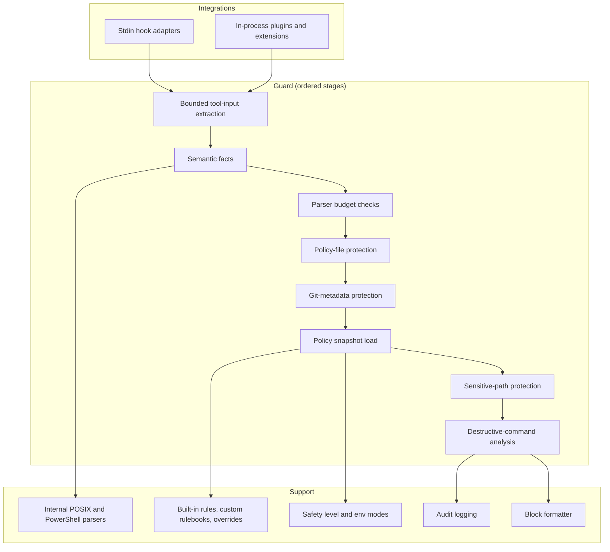
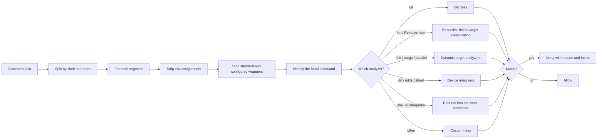

This is the third page of the technical sequence and the deepest system-wide view: it is written for maintainers and reviewers, and it is the canonical specification of the guard pipeline that [How it works](/guides/how-it-works) and [Integration architecture](/guides/integration-architecture) summarize from above.

CC Safety Net is a static, pre-execution policy gate. Every supported coding agent hands it a tool call, and every tool call runs through the same guard in the same order. The integrations differ only in how the call arrives — a stdin hook subprocess or an in-process plugin or extension — and the guard itself knows nothing about which agent issued the call.

The stage order below is specified here and nowhere else; every other page states it in a sentence or two and links back. For each analyzer's exact behavior, continue to [Analysis engine](/guides/analysis-engine).

## System components

```mermaid
graph TD
    subgraph Integrations
        Hooks["Stdin hook adapters"]
        InProc["In-process plugins and extensions"]
    end

    subgraph Guard["Guard (ordered stages)"]
        Extract["Bounded tool-input extraction"]
        Facts["Semantic facts"]
        Budgets["Parser budget checks"]
        PolicyGuard["Policy-file protection"]
        GitGuard["Git-metadata protection"]
        Snapshot["Policy snapshot load"]
        Secret["Sensitive-path protection"]
        Analyze["Destructive-command analysis"]
    end

    subgraph Support
        Parsers["Internal POSIX and PowerShell parsers"]
        Rules["Built-in rules, custom rulebooks, overrides"]
        Env["Safety level and env modes"]
        Audit["Audit logging"]
        Format["Block formatter"]
    end

    Hooks --> Extract
    InProc --> Extract

    Extract --> Facts
    Facts --> Budgets
    Budgets --> PolicyGuard
    PolicyGuard --> GitGuard
    GitGuard --> Snapshot
    Snapshot --> Secret
    Secret --> Analyze

    Facts --> Parsers
    Snapshot --> Rules
    Snapshot --> Env
    Analyze --> Format
    Analyze --> Audit
```

## Integration adapters

Adapters translate one agent's tool-call payload into a normalized invocation and translate the guard's decision back into that agent's deny format. Two things are worth knowing at the system level:

- An adapter grants **command-execution capability only to exact, integration-specific tool names**. An unknown tool never gets shell-command treatment; it still receives policy-file and sensitive-path inspection, but its text is not parsed as a command.
- Adapters own the `config-state` reporting path. The guard itself never emits that stage.

Which agent uses which adapter, its hook flag, and where its config lives are all in [Integration architecture](/guides/integration-architecture); the commands that set them up are in [Installation](/installation).

## The policy snapshot

`loadPolicySnapshot()` composes the effective runtime policy from local policy configuration, rulebook lockfiles, and verified rulebook cache entries. Its contract matters as much as its content:

- It performs **no writes, no network requests, and no in-memory caching**. Synchronizing a remote rulebook stays an explicit CLI operation (`cc-safety-net rule sync`).
- The result is **deeply immutable**. The policy object, the rules array, each rule and its `block_args`, the transparent-wrapper list, the safety block and its overrides, the destructive-command rule overrides, the allow paths, and the secret-protection block with its disabled rules and deny paths are all frozen, as is the snapshot wrapper itself.
- It resolves to exactly **two states**: `ready`, where every validated source is enforced, and `degraded`, where a candidate source was rejected and something safe is enforced in its place. A degraded reason names the failing source, states what is not active, and states the repair.
- Per-rule provenance — rulebook name and version, public source spec, override reason — is registered onto the snapshot, which is what diagnostics and the GUI render.

Invalid configuration never turns into a denial of ordinary work: a rejected source is dropped, not converted into a block. See [Configuration recovery](/configuration/recovery) for the full state contract and the repair path.

## The ordered guard stages

Every tool call, on every integration, runs this fixed order. The stage names are the ones that appear as `failureStage` in the audit log.

| # | Stage | What happens | Weakenable by policy? |
| --- | --- | --- | --- |
| 1 | `policy-protection` | Extract the command from the tool input under traversal bounds (depth, node count, key count, per-string and aggregate byte size). Exceeding a bound fails closed. | No |
| 2 | — | Build semantic facts from the invocation — one parse, reused by every later stage. | No |
| 3 | `command-analysis` | Declared-command parser budget exceeded, so the command is denied for hitting the recursion limit. | No |
| 4 | `command-validation` | Structural command-validation budget exceeded (input length, word count, nesting depth), so the command is denied. | No |
| 5 | — | Resolve protected Git metadata for the execution working directory. | No |
| 6 | `policy-protection` | **Policy-file protection** — a write, move, or recursive delete touching the canonical user `policy.json`, its directory, or an ancestor is denied with intent `hard_stop`. | No |
| 7 | `policy-protection` | **Git-metadata protection** — a delete, move, redirection, write-tool, or patch route targeting the resolved `.git` entry, its directories, or its hooks directories is denied with intent `hard_stop`. | No |
| 8 | `config-load` | **Load the policy snapshot** and resolve the effective safety level from policy plus environment. | — |
| 9 | `secret-protection` | **Sensitive-path protection** — command, path, search, and patch shapes are inspected for built-in sensitive paths and configured deny paths; a match denies with intent `hard_stop` and carries the matched rule id. Skipped entirely when secret protection is disabled in policy. | Yes |
| 10 | `non-command` | Non-command invocations that survived stages 1–9 are allowed here. | — |
| 11 | `command-validation` | An empty or blank command text fails closed. | No |
| 12 | `command-analysis` | **Destructive-command analysis** runs with the snapshot, the effective capabilities, the parsed program, the fact store, and the resolved Git metadata — then either blocks or allows. | Partly |

Three placement facts follow directly from that order:

- **Stages 6 and 7 run before stage 8.** Policy-file protection and Git-metadata protection deny *before* any configuration is loaded. They are always on, they carry no config state, and no preset, override, or master switch can weaken them.
- **Sensitive-path protection runs after the snapshot and before command analysis.** It is the one of the three hard-stop protections that policy controls, through the master switch, per-pattern overrides, and deny paths.
- **Only decisions made after stage 8 report a safety level.** Denials from the input bounds, policy-file protection, or Git-metadata protection intentionally carry no `level` and no config-fallback metadata, because neither was known yet.

Every dependency call inside the guard is wrapped, so a thrown error becomes a fail-closed deny attributed to the stage that threw. When a tool-input bound is the cause, command-substitution-sourced text is stripped from the evidence so oversized input is never echoed back.

## Inside command analysis

Stage 12 is where the classifier runs. It splits a command by shell operators into segments and walks each segment independently; if any segment blocks, the whole command is denied.

```mermaid
graph LR
    Input["Command text"] --> Split["Split by shell operators"]
    Split --> Seg["For each segment"]
    Seg --> StripEnv["Strip env assignments"]
    StripEnv --> StripWrap["Strip standard and configured wrappers"]
    StripWrap --> Identify["Identify the head command"]
    Identify --> Dispatch{"Which analyzer?"}
    Dispatch -->|git| GitAnalyze["Git rules"]
    Dispatch -->|rm / Remove-Item| RmAnalyze["Recursive-delete target classification"]
    Dispatch -->|find / xargs / parallel| OtherAnalyze["Dynamic-target analyzers"]
    Dispatch -->|dd / mkfs / shred| DeviceAnalyze["Device analyzers"]
    Dispatch -->|shell or interpreter| Recurse["Recurse into the inner command"]
    Dispatch -->|other| Custom["Custom rules"]
    GitAnalyze --> Blocked{"Match?"}
    RmAnalyze --> Blocked
    OtherAnalyze --> Blocked
    DeviceAnalyze --> Blocked
    Recurse --> Blocked
    Custom --> Blocked
    Blocked -->|yes| Deny["Deny with reason and intent"]
    Blocked -->|no| Allow["Allow"]
```

The engine tracks working-directory changes across segments (via `cd` and `pushd`) and propagates environment assignments, so target classification reflects what a real shell would do. Recursion into shell wrappers and interpreter bodies is capped at 10 levels. See [Analysis engine](/guides/analysis-engine) for each analyzer, the safety-level boundaries, and the full target-classification order.

## Parsers and the runtime dependency surface

`parseCommand(source, dialect, limits)` dispatches to CC Safety Net's **own POSIX parser** or its **own PowerShell parser**; the `auto` dialect sniffs which one applies. Both are internal modules, not wrappers around a third-party grammar.

Parser budgets are compile-time constants, not policy settings, so no configuration can raise them:

| Budget | Value |
| --- | --- |
| Maximum input length | 131,072 UTF-16 code units |
| Maximum words | 16,384 |
| Maximum nesting depth | 64 |

The analyzer's public contract is deliberately narrow: it returns nothing on allow and a result object on block. It never exposes the parser's internal `complete` / `partial` / `limited` states, so callers cannot branch on parse confidence.

PowerShell support is a **conservative subset**, centered on `Remove-Item` and its aliases plus the existing cross-shell rules. It preserves native quoting, path separators, connectors, pipelines, and dynamic-word provenance for that subset. It is not a general PowerShell interpreter.

### Dependencies

CC Safety Net has **one runtime package dependency, `zod`**, used only for configuration validation. It is loaded lazily through `createRequire`, so the cost is paid only when configuration is actually validated, and it is kept external in the Node and Pi bundles so it resolves from the installed package. Exactly one source module imports it.

Published bundles additionally embed **`shell-quote`**, which supplies legacy POSIX token projection and display formatting for a small number of call sites. It sits in `devDependencies` because consumers never resolve it at runtime, but its bundled code is part of the production security surface and is monitored, audited, and updated as such. It is **not** the parser foundation — the structural command representation comes from the internal POSIX and PowerShell parsers described above.

The published runtime target is Node.js 18 or newer.

## Key design properties

- **One fixed order, every integration.** The stage table above is the whole contract. There is no per-agent branch in the guard.
- **Always-on protections precede configuration.** Policy-file and Git-metadata protection cannot be disabled, because they deny before the policy that could disable them is read.
- **Fail-closed on the guard's own failure.** A thrown dependency, an exhausted parser budget, or a violated tool-input bound denies rather than allows, attributed to the stage that failed. Invalid *configuration* is a separate case and does not deny — see [Configuration recovery](/configuration/recovery).
- **No network, no writes at evaluation time.** Runtime evaluation performs no network requests, and the snapshot loader performs no writes. Nothing in the guard inspects or filters egress.
- **Platform-agnostic core.** Adapters translate formats; the guard and the classifier are shared verbatim.
- **Bounded, not exhaustive.** This is a static pre-execution policy gate, not an OS sandbox, a privilege boundary, or protection for commands that bypass an installed integration. See [Known limitations](/guides/known-limitations).

## Where to go next

The technical guides run from the user-facing lifecycle down to the reasoning behind the design. This page is step 3.

- Back: [Integration architecture](/guides/integration-architecture) — how each agent's call reaches the adapters above, and [How it works](/guides/how-it-works) for the same sequence at user depth.
- Next: [Analysis engine](/guides/analysis-engine) — stage 12 in detail: each analyzer, the safety-level boundaries, and the recursive-delete classification order.
- Then: [Design principles](/guides/design-principles) — why the order, the always-on protections, and the owned parsers are what they are.

Related: [Configuration recovery](/configuration/recovery) for `ready` versus `degraded`, [Security model](/guides/security-model) for trust boundaries, and [Known limitations](/guides/known-limitations) for what this design cannot cover.
