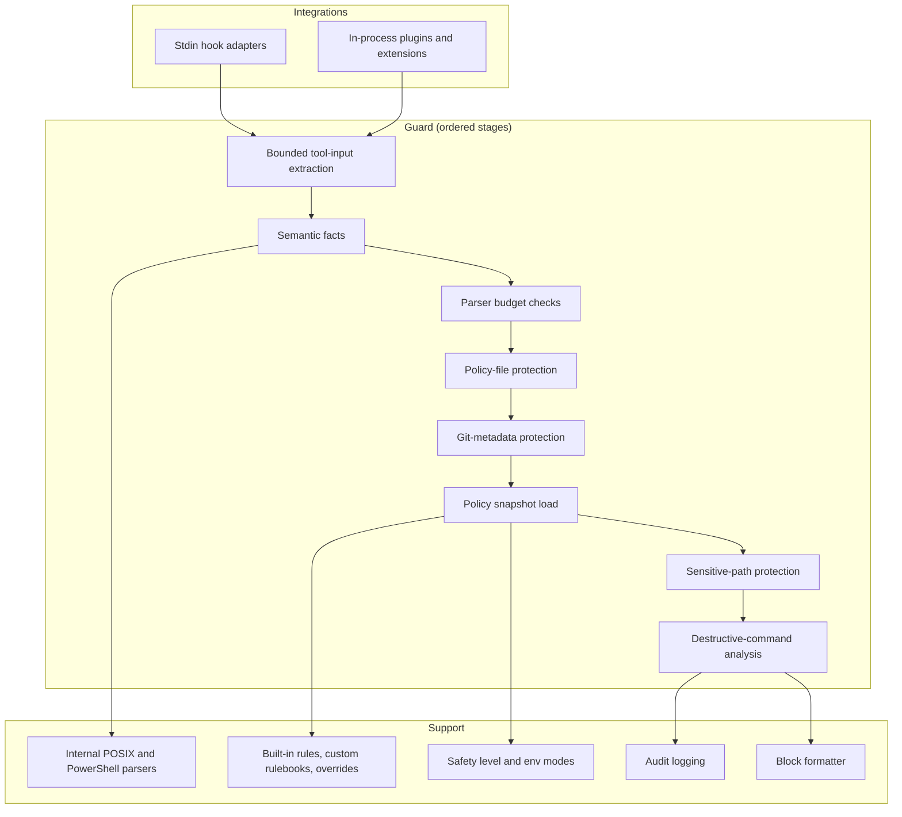
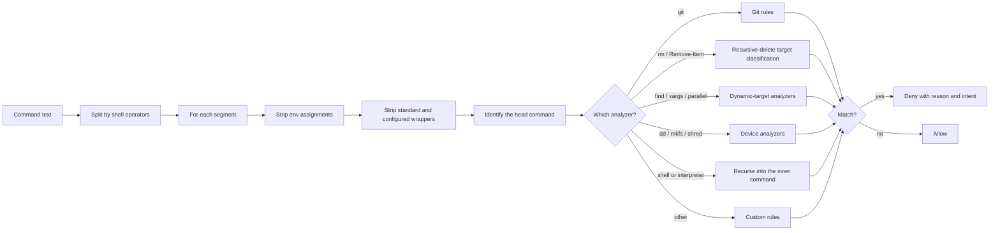

このページは、メンテナー向けのガードパイプラインの仕様です。ユーザー向けの視点は[仕組み](/ja/guides/how-it-works)を、各エージェントがどのようにガードへ到達するかは[連携アーキテクチャ](/ja/guides/integration-architecture)を参照してください。

CC Safety Net は、静的な実行前ポリシーゲートです。対応する各コーディングエージェントがツール呼び出しを CC Safety Net に送り、ガードはどの呼び出しも同じ順序で検査します。連携ごとに違うのは呼び出しの届き方だけで、標準入力を使う hook subprocess か、プロセス内のプラグイン／拡張機能のいずれかです。

以下のステージ順序は、このページで規定します。他のページでは概要だけを示し、ここへリンクしています。各アナライザーの詳しい挙動は、[解析エンジン](/ja/guides/analysis-engine)を参照してください。

## システム構成要素

## 連携アダプター

アダプターは、エージェントのツール呼び出しのペイロードを正規化された呼び出し情報に変換し、ガードの判定をそのエージェント向けの拒否形式に戻します。システム全体から見ると、アダプターがコマンド実行として扱うのは、**連携ごとに定めた特定のツール名だけ**です。未知のツールがシェルコマンドとして扱われることはありません。ポリシーファイル、Git メタデータ、機密パスの検査は引き続き受けますが、その内容がコマンドとしてパースされることはありません。

各エージェントが使うアダプター、hook のフラグ、設定ファイルの場所は、すべて[連携アーキテクチャ](/ja/guides/integration-architecture)にまとめてあります。設定用のコマンドは[インストール](/ja/installation)を参照してください。

## ポリシースナップショット

`loadPolicySnapshot()` は、ユーザーポリシーファイル、プロジェクトポリシーファイル、各スコープの `rule.json`、そして設定された各設定元が指す rulebook ファイルから、実行時に適用するポリシーを組み立てます。内容だけでなく、次の実行時契約も重要です。

- **書き込み、ネットワーク通信、メモリ上のキャッシュのいずれも行いません。** rulebook はライブファイルであり、ローダーはツール呼び出しのたびに各 `rulebook.json` をディスクから読み取ります。ネットワークに接続するのは `cc-safety-net rule add` と `cc-safety-net rule update` だけです。
- 結果は**再帰的に不変（immutable）**です。ポリシーオブジェクト、rules 配列、各ルールとその `block_args`、transparent wrapper の一覧、safety ブロックとその override、破壊的コマンドルールの override、allow path、無効化されたルールと deny path を含むシークレット保護のブロックが、いずれも freeze されます。スナップショットのラッパー自体も freeze されます。
- 結果は必ず **2 つの状態**のどちらかになります。`ready` では検証済みの設定元がすべて適用されます。`degraded` では、候補となった設定元が拒否され、代わりに安全な既定値が適用されます。degraded の理由には、失敗した設定元、有効になっていないもの、修復方法が示されます。
- ルールごとの出所情報（rulebook の名前とバージョン、公開の設定元指定、override の理由）がスナップショットに記録されます。プロジェクトポリシーファイルがある場合は、安全レベルをどのスコープが設定したかと、プロジェクトポリシーが緩和したフィールドごとに 1 行が併せて記録されます。これらは診断表示と GUI に表示されます。

ポリシーやルールの設定元が拒否されたというだけの理由で、通常のツール呼び出しが拒否されることはありません。ランタイムは設定元をブロックに変換するのではなく、破棄します。状態の取り決めと修復手順は、[設定の復旧](/ja/configuration/recovery)を参照してください。

## 順序付きガードステージ

どの連携でも、ツール呼び出しは次の固定順序で処理されます。拒否した操作は、表に示した `failureStage` の値とともに監査ログに記録されます。

| # | 記録される `failureStage` | 処理内容 | ポリシーで弱められるか |
| --- | --- | --- | --- |
| 1 | `policy-protection` | 走査の上限（深さ、ノード数、キー数、文字列単位および合計のバイト数）の範囲内で、ツール入力からコマンドを抽出する。上限を超えた場合は fail closed になる。 | いいえ |
| 2 | 該当なし | 呼び出し情報から意味情報を構築する。パースは 1 回だけで、以降のすべてのステージが再利用する。 | いいえ |
| 3 | `command-analysis` | 宣言されたコマンドのパーサー処理上限を超えたため、再帰上限に達したものとしてコマンドを拒否する。 | いいえ |
| 4 | `command-validation` | 構造的な検証の上限（入力長、語数、ネストの深さ）を超えたため、コマンドを拒否する。 | いいえ |
| 5 | 該当なし | 実行時の作業ディレクトリについて、保護対象の Git メタデータを解決する。 | いいえ |
| 6 | `policy-protection` | **ポリシーファイルの保護**。ユーザー `policy.json`、プロジェクト `policy.json`、プロジェクトファイル自身の `.cc-safety-net` ディレクトリ、ユーザーファイルのディレクトリとその上位ディレクトリに触れる書き込み・移動・再帰削除を、intent `hard_stop` で拒否する。エージェントによる `cc-safety-net policy apply` の実行も、このステージで同じ intent で拒否する。`cc-safety-net policy check` は許可されたまま。 | いいえ |
| 7 | `policy-protection` | **Git メタデータの保護**。解決済みの `.git` エントリ、そのディレクトリ、hooks ディレクトリを対象とする削除・移動・リダイレクト・書き込み系ツール・patch・未知のツール経由の操作を、intent `hard_stop` で拒否する。書き込み系ツール、patch、未知のツールの経路では、読み取り専用ツールは対象外。 | いいえ |
| 8 | `config-load` | **ポリシースナップショットを読み込み**、ポリシーと環境変数から実際に適用する安全レベルを決定する。 | 該当なし |
| 9 | `secret-protection` | **機密パスの保護**。コマンド、パス、検索、patch の各形式について、組み込みの機密パスと設定済みの deny path を検査する。一致した場合は intent `hard_stop` で拒否し、一致したルール ID を添える。ポリシーでシークレット保護が無効な場合は、このステージを完全にスキップする。 | はい |
| 10 | `non-command` | ステージ 1〜9 を通過したコマンド以外の呼び出しは、ここで許可される。 | 該当なし |
| 11 | `command-validation` | コマンド文字列が空、または空白のみの場合は fail closed になる。 | いいえ |
| 12 | `command-analysis` | **破壊的コマンドの解析**。スナップショット、実際に有効な機能、パース済みのプログラム、意味情報のストア、解決済みの Git メタデータを使って実行し、ブロックまたは許可を決める。 | 一部 |

この順序から、次の 3 点が直接導かれます。

- **ステージ 6 と 7 は、ステージ 8 より前に実行されます。** ポリシーファイルの保護と Git メタデータの保護は、設定を読み込む*前*に拒否を返します。常に有効で、設定の状態を一切持たず、preset・override・マスタースイッチのいずれでも弱められません。
- **機密パスの保護は、スナップショットの後、コマンド解析の前に実行されます。** 3 つある即時ブロックの保護のうち、ポリシーで制御できるのはこれだけで、マスタースイッチ、パターンごとの override、deny path で調整します。
- **安全レベルを報告できるのは、ステージ 8 より後の判定だけです。** 入力上限、ポリシーファイルの保護、Git メタデータの保護による拒否には、意図的に `level` と設定フォールバックの情報が含まれません。その時点ではどちらもまだ分かっていないからです。

ガード内の依存呼び出しはすべてラッパーで包まれています。そのため、投げられた例外は、それを投げたステージに紐づく fail closed の拒否になります。ツール入力の上限が原因の場合は、コマンド置換に由来するテキストを根拠情報から取り除きます。これにより、過大な入力がそのまま外部へ返ることはありません。

## コマンド解析の内部

ステージ 12 で分類処理が動きます。コマンドをシェルの演算子でセグメントに分割し、各セグメントを個別に検査します。1 つでもブロック対象があれば、コマンド全体を拒否します。

エンジンはセグメント間での作業ディレクトリの変更（`cd` と `pushd`）を追跡し、環境変数の代入を伝播します。そのため、対象の分類は実際のシェルの挙動を反映します。シェルラッパーやインタープリターの本体への再帰は、最大 10 階層までです。各アナライザー、安全レベルの境界、対象分類の完全な順序は、[解析エンジン](/ja/guides/analysis-engine)を参照してください。

## パーサーと実行時の依存関係

`parseCommand(source, dialect, limits)` は、CC Safety Net **自前の POSIX パーサー**または**自前の PowerShell パーサー**に処理を振り分けます。`auto` を指定した場合は、どちらを使うかを自動判定します。どちらも内部モジュールであり、サードパーティの文法定義をラップしたものではありません。

パーサーとアナライザーの処理上限はコンパイル時の定数で、ポリシーの設定項目ではありません。そのため、設定で引き上げることはできません。

| 上限 | 値 |
| --- | --- |
| 入力長の上限 | 131,072 UTF-16 コードユニット |
| 語数の上限 | 16,384 |
| ネストの深さの上限 | 64 |
| 派生コマンドの処理量の上限 | 派生トークン 16,384 個 |

最初の 3 つは、最初のパース処理を制限します。4 つ目は、パース後にアナライザーがコマンドから*派生させる*作業量を制限します。対象になるのは、`find -exec`、`xargs`、`parallel` から再構築した子コマンド、ラッパーの背後に埋め込まれたコマンド、アナライザーに再投入する追跡済みの heredoc ファイル、PowerShell の `Invoke-Expression` のソースです。これを使い切ると、`"Command analysis exceeds CC Safety Net's derived-command work limit. Reduce nested or embedded command complexity and retry."` という理由で拒否します。これは再帰の深さの上限とも、上のステージ表にある構造的な検証の上限とも別の失敗です。

アナライザーの公開インターフェースは意図的に狭くしてあります。許可のときは何も返さず、ブロックのときだけ結果オブジェクトを返します。パーサー内部の `complete` / `partial` / `limited` という状態は公開しないため、呼び出し側がパースの確信度で処理を分岐させることはできません。

PowerShell への対応は、`Remove-Item` とその別名、および既存のシェル共通ルールを中心とした**限定的なサブセット**です。そのサブセットの範囲では、PowerShell 固有のクオート、パス区切り、接続演算子、パイプライン、動的な語の出どころを保持します。汎用の PowerShell インタープリターではありません。

### 依存関係

CC Safety Net の実行時のパッケージ依存は **`zod` の 1 つだけ**で、設定の検証にのみ使用します。ソースコードでは `createRequire` を使って遅延読み込みします。分割された Node バンドル（Pi 向けを含む）もこの挙動を保ち、遅延読み込み先を同梱の `dist/vendor/zod.cjs` に向けます。単体で配布する Amp 用と OpenClaw 用の成果物では、代わりに `zod` をインライン展開します。`zod` を import しているソースモジュールは、ちょうど 1 つだけです。

公開されるバンドルには、**サードパーティ製のシェルパーサーは含まれません**。パススキャナーが読み取るフラットなエントリ列は、`projectShellSyntax` によってパース済みの中間表現から射影したものです。したがって、シェルの構造情報の出どころは、上に挙げた内部の POSIX パーサーと PowerShell パーサーだけであり、生のコマンド文字列を 2 度目にトークン化して結果がずれることはありません。

公開時の対象ランタイムは Node.js 18 以降です。

## 主な設計特性

- **すべての連携で共通の、1 つの固定順序。** 上のステージ表がそのまま仕様のすべてです。ガードにエージェントごとの分岐はありません。
- **常時有効な保護は設定より前に動く。** ポリシーファイルの保護と Git メタデータの保護は、それらを無効化しうるポリシーを読み込む前に拒否を返すため、無効化できません。
- **ガード自身の失敗では fail closed。** 依存処理が投げた例外、パーサーの処理上限の枯渇、ツール入力の上限違反は、いずれも許可ではなく拒否になり、失敗したステージに紐づけられます。無効な*設定*はこれとは別扱いで、拒否にはなりません。[設定の復旧](/ja/configuration/recovery)を参照してください。
- **評価中にネットワーク通信も書き込みも行わない。** 実行時の評価はネットワーク通信を行わず、スナップショットの読み込み処理は書き込みを行いません。ガードが外向きの通信を検査・遮断することもありません。
- **中核はプラットフォームに依存しない。** アダプターが形式を変換し、ガードと分類処理はそのまま共有されます。
- **範囲は限定的で、網羅的ではない。** これは静的な実行前ポリシーゲートであり、OS のサンドボックス、権限境界、インストール済み連携を迂回するコマンドに対する保護ではありません。[既知の制限](/ja/guides/known-limitations)を参照してください。

## 次に読むページ

技術ガイドは、ユーザー向けのライフサイクルの説明から設計の理由へと順に降りていく構成です。このページはその 3 番目にあたります。

- 戻る：[連携アーキテクチャ](/ja/guides/integration-architecture)には、各エージェントの呼び出しが上記のアダプターに到達するまでの流れが、[仕組み](/ja/guides/how-it-works)には、同じ順序のユーザー向けの説明があります。
- 次へ：[解析エンジン](/ja/guides/analysis-engine)では、ステージ 12 を掘り下げ、各アナライザー、安全レベルの境界、再帰削除の対象分類の順序を説明します。
- その次：[設計原則](/ja/guides/design-principles)では、この順序、常時有効な保護、自前のパーサーを採用した理由を説明します。

関連ページ：`ready` と `degraded` については[設定の復旧](/ja/configuration/recovery)、信頼境界については[セキュリティモデル](/ja/guides/security-model)、この設計で対応できない範囲については[既知の制限](/ja/guides/known-limitations)を参照してください。
