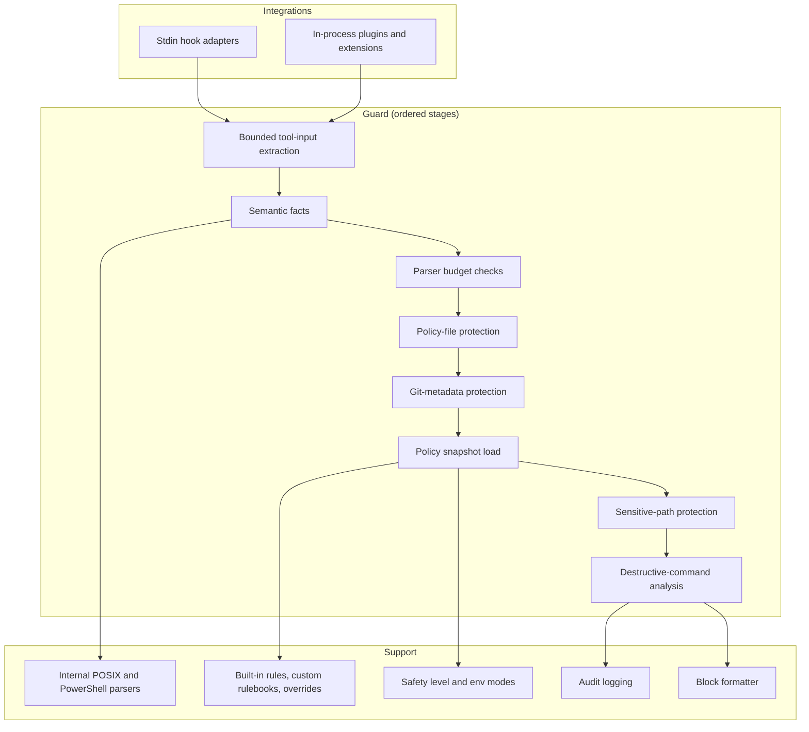
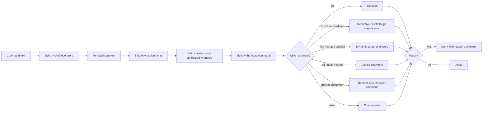

このページは、保守者向けの guard pipeline 仕様です。[仕組み](/ja/guides/how-it-works)ではユーザー向けの視点を示します。[連携アーキテクチャ](/ja/guides/integration-architecture)では、各エージェントが guard に到達する仕組みを示します。

CC Safety Net は、静的な実行前ポリシーゲートです。対応する各コーディングエージェントは、ツール呼び出しを CC Safety Net に送ります。guard は、各呼び出しを同じ順序で確認します。連携間の違いは、呼び出しの到着方法だけです。標準入力を使う hook subprocess、または process 内の plugin や extension を使います。

次の stage 順序は、このページだけで規定します。他の各ページでは、1～2 文で説明してこのページへ link します。各 analyzer の正確な動作は、[解析エンジン](/ja/guides/analysis-engine)を参照してください。

## システム構成要素

## 連携 adapter

adapter は、エージェントのツール呼び出し payload を正規化した invocation に変換し、guard の判定をそのエージェントの deny format に変換します。システムレベルでは、次の 2 点が重要です。

- adapter がコマンド実行 capability を与えるのは、**連携ごとに定めた正確な tool name だけ**です。unknown tool は shell-command として扱われません。policy-file、Git-metadata、sensitive-path の inspection は引き続き受けますが、その text は command として parse されません。
- adapter は `config-state` reporting path を所有します。guard 自身は、この stage を出力しません。

各エージェントが使う adapter、hook flag、設定の場所は、すべて[連携アーキテクチャ](/ja/guides/integration-architecture)にあります。設定するコマンドは[インストール](/ja/installation)を参照してください。

## Policy snapshot

`loadPolicySnapshot()` は、local policy configuration、rulebook lockfile、検証済み rulebook cache entry から、有効な runtime policy を構成します。その contract は内容と同じくらい重要です。

- **書き込み、network request、in-memory caching を行いません。** remote rulebook の同期は、明示的な CLI 操作（`cc-safety-net rule sync`）のままです。
- 結果は**深く immutable**です。policy object、rules array、各 rule とその `block_args`、transparent-wrapper list、safety block とその override、destructive-command rule override、allow path、disabled rule と deny path を含む secret-protection block はすべて freeze されます。snapshot wrapper 自身も freeze されます。
- 結果は正確に **2 つの state** になります。`ready` では、検証済みのすべての source が適用されます。`degraded` では、candidate source が拒否され、代わりに安全なものが適用されます。degraded reason は、失敗した source、active でないもの、修復方法を示します。
- rule ごとの provenance（rulebook name と version、public source spec、override reason）は snapshot に登録され、diagnostics と GUI が表示します。

拒否された policy または rule source だけを理由に、通常のツール呼び出しを拒否することはありません。runtime は source を block に変換せず、drop します。state contract と修復手順は[設定の復旧](/ja/configuration/recovery)を参照してください。

## 順序付き guard stage

すべての連携の各ツール呼び出しは、次の固定順序で実行されます。拒否する操作は、audit log に示した `failureStage` value を記録します。

| # | 記録する `failureStage` | 動作 | policy で弱められるか |
| --- | --- | --- | --- |
| 1 | `policy-protection` | traversal bound（depth、node count、key count、string ごとおよび合計 byte size）の範囲内で tool input から command を抽出します。bound 超過時は fail closed します。 | いいえ |
| 2 | — | invocation から semantic fact を作ります。1 回 parse し、後続の各 stage が再利用します。 | いいえ |
| 3 | `command-analysis` | declared-command parser budget を超過したため、recursion limit 到達として command を拒否します。 | いいえ |
| 4 | `command-validation` | structural command-validation budget（input length、word count、nesting depth）を超過したため、command を拒否します。 | いいえ |
| 5 | — | 実行 working directory の protected Git metadata を解決します。 | いいえ |
| 6 | `policy-protection` | **Policy-file protection**：canonical user `policy.json`、その directory、ancestor に触れる write、move、recursive delete を intent `hard_stop` で拒否します。 | いいえ |
| 7 | `policy-protection` | **Git-metadata protection**：解決済み `.git` entry、その directory、hooks directory を対象にする delete、move、redirection、write-tool、patch、unknown-tool route を intent `hard_stop` で拒否します。write-tool、patch、unknown-tool route では read-only tool を除外します。 | いいえ |
| 8 | `config-load` | **Policy snapshot を読み込み**、policy と environment から有効な safety level を解決します。 | — |
| 9 | `secret-protection` | **Sensitive-path protection**：command、path、search、patch shape について、built-in sensitive path と設定済み deny path を検査します。一致すると intent `hard_stop` で拒否し、matched rule id を付けます。policy で secret protection が無効な場合は完全に skip します。 | はい |
| 10 | `non-command` | stage 1～9 を通過した non-command invocation は、ここで許可します。 | — |
| 11 | `command-validation` | 空または blank の command text は fail closed します。 | いいえ |
| 12 | `command-analysis` | **Destructive-command analysis** は snapshot、有効な capability、parsed program、fact store、解決済み Git metadata を使って実行し、block または allow します。 | 一部 |

この順序から、次の 3 点が直接導かれます。

- **stage 6 と 7 は stage 8 より前に実行します。** Policy-file protection と Git-metadata protection は、設定を読み込む*前*に拒否します。常に有効で、config state を持たず、preset、override、master switch で弱めることはできません。
- **Sensitive-path protection は snapshot の後、command analysis の前に実行します。** 3 つの hard-stop protection のうち、policy が制御できるのはこれだけです。master switch、pattern ごとの override、deny path で制御します。
- **stage 8 より後の判定だけが safety level を報告します。** input bound、policy-file protection、Git-metadata protection による拒否には、意図的に `level` と config-fallback metadata がありません。その時点では、どちらもまだ不明なためです。

guard 内の各 dependency call は wrapper で囲まれます。このため、throw された error は、throw した stage に属する fail-closed deny になります。tool-input bound が原因の場合は、command-substitution 由来の text を evidence から削除します。これにより、oversized input を外部へ返しません。

## Command analysis の内部

stage 12 で classifier を実行します。shell operator で command を segment に分割し、各 segment を個別に調べます。1 つでも block すると command 全体を拒否します。

engine は、segment 間の working-directory change（`cd` と `pushd`）を追跡し、environment assignment を伝播します。このため、target classification は実際の shell の動作を反映します。shell wrapper と interpreter body への recursion は最大 10 level です。各 analyzer、safety-level boundary、完全な target-classification order は[解析エンジン](/ja/guides/analysis-engine)を参照してください。

## Parser と runtime dependency surface

`parseCommand(source, dialect, limits)` は、CC Safety Net **独自の POSIX parser** または**独自の PowerShell parser**に dispatch します。`auto` dialect は、適用するものを判定します。どちらも内部 module であり、third-party grammar の wrapper ではありません。

Parser と analyzer の budget は compile-time constant で、policy setting ではありません。そのため、設定で増やすことはできません。

| Budget | 値 |
| --- | --- |
| Maximum input length | 131,072 UTF-16 code units |
| Maximum words | 16,384 |
| Maximum nesting depth | 64 |
| Maximum derived-command work | 16,384 derived tokens |

最初の 3 つは initial parse を制限します。4 番目は parse 後に analyzer が command から*派生させる*作業を制限します。対象は、`find -exec`、`xargs`、`parallel` から再構築した child command、wrapper の後ろに埋め込まれた command、analyzer に replay する tracked heredoc file、PowerShell `Invoke-Expression` source です。使い切ると、`"Command analysis exceeds CC Safety Net's derived-command work limit. Reduce nested or embedded command complexity and retry."` という reason で拒否します。これは recursion-depth limit と、上の stage table にある structural validation limit とは異なる failure です。

analyzer の public contract は意図的に狭くしています。allow では何も返さず、block では result object を返します。parser 内部の `complete` / `partial` / `limited` state は公開しないため、caller は parse confidence で分岐できません。

PowerShell support は `Remove-Item` とその alias、および既存の cross-shell rule を中心とする**保守的な subset**です。その subset について、native quoting、path separator、connector、pipeline、dynamic-word provenance を保持します。汎用 PowerShell interpreter ではありません。

### Dependency

CC Safety Net の runtime package dependency は **`zod` 1 つだけ**で、configuration validation のみに使います。source は `createRequire` で遅延読み込みします。split Node bundle（Pi を含む）はこの挙動を保持し、その遅延読み込み先を同梱の `dist/vendor/zod.cjs` に向けます。standalone の Amp artifact と OpenClaw artifact は、代わりに `zod` を inline にします。import する source module は正確に 1 つです。

公開 bundle は **third-party shell parser を含みません**。path scanner が読み取る flat entry stream は、`projectShellSyntax` により parsed IR から投影します。このため、上記の内部 POSIX parser と PowerShell parser が唯一の shell structure source です。raw command text を 2 回目に tokenize して drift することはありません。

公開 runtime target は Node.js 18 以降です。

## 主な設計特性

- **すべての連携で 1 つの固定順序。** 上の stage table が contract 全体です。guard には agent ごとの branch がありません。
- **常時有効な保護を設定より前に実行。** Policy-file protection と Git-metadata protection は、無効化できる policy を読み込む前に拒否するため、無効化できません。
- **guard 自身の failure で fail closed。** dependency の throw、parser budget の枯渇、tool-input bound の違反は、allow ではなく deny になり、失敗した stage に属します。無効な*設定*は別の場合で、deny しません。[設定の復旧](/ja/configuration/recovery)を参照してください。
- **評価時に network も write もない。** runtime 評価は network request を行わず、snapshot loader は write しません。guard は外向き通信を検査または filter しません。
- **Platform-agnostic core。** adapter が format を変換し、guard と classifier はそのまま共有されます。
- **上限付きであり、網羅的ではない。** これは静的な実行前ポリシーゲートで、OS sandbox、privilege boundary、インストール済み連携を回避する command に対する保護ではありません。[既知の制限](/ja/guides/known-limitations)を参照してください。

## 次に読むページ

技術ガイドは、ユーザー向けの lifecycle から設計理由まで順に説明します。このページは step 3 です。

- 前：[連携アーキテクチャ](/ja/guides/integration-architecture)：各 agent call が上記の adapter に到達する仕組み。[仕組み](/ja/guides/how-it-works)：同じ順序をユーザー向けの深さで説明します。
- 次：[解析エンジン](/ja/guides/analysis-engine)：stage 12 の詳細。各 analyzer、safety-level boundary、recursive-delete classification order を説明します。
- その次：[設計原則](/ja/guides/design-principles)：order、always-on protection、owned parser を採用した理由を説明します。

関連ページ：[設定の復旧](/ja/configuration/recovery)：`ready` と `degraded`。[セキュリティモデル](/ja/guides/security-model)：trust boundary。[既知の制限](/ja/guides/known-limitations)：この設計で対応できない範囲。
