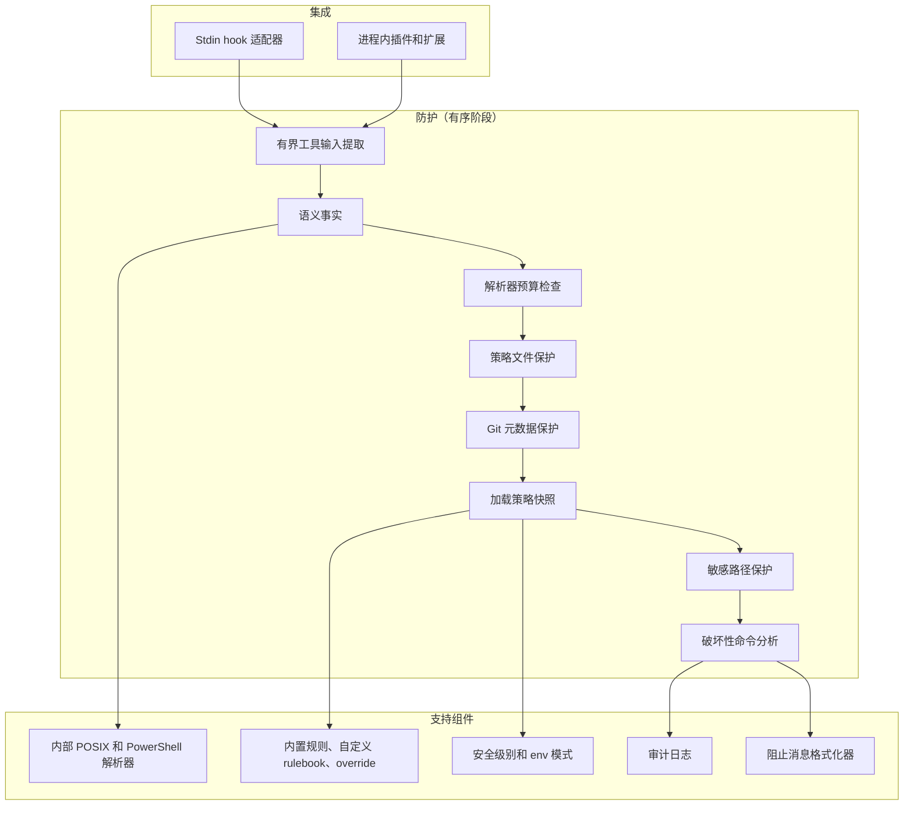
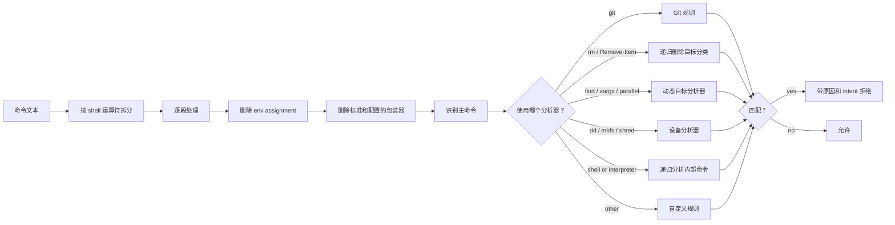

本页定义供维护者查阅的防护管线。<a href="/zh-Hans/guides/how-it-works">工作原理</a>从用户角度说明同一流程。<a href="/zh-Hans/guides/integration-architecture">集成架构</a>说明各智能体如何接入防护。

CC Safety Net 是静态执行前策略门。每个受支持的编码智能体都会向它发送工具调用，防护按相同顺序检查每个调用。集成之间的差异仅在于调用的到达方式：标准输入 hook 子进程，或进程内插件与扩展。

下列阶段顺序只在此定义。其他页面只用一两句说明，并链接回本页。每个分析器的具体行为见<a href="/zh-Hans/guides/analysis-engine">分析引擎</a>。

## 系统组件

## 集成适配器

适配器把智能体的工具调用 payload 转为规范 invocation，并把防护判定转为智能体的 deny 格式。在系统层面，适配器只向精确匹配的、集成专用的工具名授予**命令执行能力**。未知工具不会按 shell 命令处理，它仍接受策略文件、Git 元数据和敏感路径检查，但其文本不会解析为命令。

各智能体的适配器、hook 标志和配置位置见<a href="/zh-Hans/guides/integration-architecture">集成架构</a>，设置命令见<a href="/zh-Hans/installation">安装</a>。

## 策略快照

`loadPolicySnapshot()` 由本地策略配置、rulebook lockfile 和已验证的 rulebook 缓存条目组合出有效运行时策略。它的约定和内容同样重要：

- 它**不写入、不发出网络请求，也不使用内存缓存**。同步远程 rulebook 始终是显式 CLI 操作（`cc-safety-net rule sync`）。
- 结果**深度不可变**。策略对象、规则数组、每条规则及其 `block_args`、透明包装器列表、安全块及其 override、破坏性命令规则 override、允许路径、机密保护块及其 disabled rule 和拒绝路径都已冻结，快照包装器本身也是如此。
- 它只解析为**两种状态**：`ready` 表示每个通过验证的来源都已生效；`degraded` 表示某个候选来源被拒绝，改为执行安全的替代内容。degraded 原因会指出失败的来源、哪些内容未生效，以及如何修复。
- 每条规则的来源信息（rulebook 名和版本、公开 source spec、override 原因）会注册到快照，供诊断和 GUI 显示。

被拒绝的策略或规则来源本身不会导致普通工具调用被拒绝。运行时会丢弃该来源，而不是把它转为阻止。状态约定和修复路径见<a href="/zh-Hans/configuration/recovery">配置恢复</a>。

## 有序防护阶段

每个集成上的每次工具调用都执行以下固定顺序。拒绝操作会在审计日志中报告所示 `failureStage` 值。

| # | 报告的 `failureStage` | 操作 | 策略可削弱？ |
| --- | --- | --- | --- |
| 1 | `policy-protection` | 在遍历边界内从工具输入提取命令，包括深度、节点数、key 数、单个字符串字节数和总字节数。超过边界时 fail closed。 | 否 |
| 2 | 无 | 从 invocation 构建语义事实。只解析一次，供后续阶段复用。 | 否 |
| 3 | `command-analysis` | 已声明命令的解析器预算超限，命令因触及递归限制被拒绝。 | 否 |
| 4 | `command-validation` | 结构化命令验证预算超限（输入长度、word 数、嵌套深度），命令被拒绝。 | 否 |
| 5 | 无 | 为执行工作目录解析受保护的 Git 元数据。 | 否 |
| 6 | `policy-protection` | **策略文件保护**：写入、移动或递归删除触及规范用户 `policy.json`、其目录或上级目录时，以 `hard_stop` intent 拒绝。 | 否 |
| 7 | `policy-protection` | **Git 元数据保护**：删除、移动、重定向、写工具、patch 或未知工具路由指向已解析 `.git` 入口、其目录或 hooks 目录时，以 `hard_stop` intent 拒绝。写工具、patch 和未知工具路由中的只读工具除外。 | 否 |
| 8 | `config-load` | **加载策略快照**，并根据策略和环境解析有效安全级别。 | 不适用 |
| 9 | `secret-protection` | **敏感路径保护**：检查 command、path、search 和 patch 形式中的内置敏感路径及配置的拒绝路径。匹配时以 `hard_stop` intent 拒绝，并携带匹配的 rule ID。策略禁用机密保护时完全跳过。 | 是 |
| 10 | `non-command` | 通过阶段 1 到 9 的非命令 invocation 在此获得允许。 | 不适用 |
| 11 | `command-validation` | 空或纯空白命令文本 fail closed。 | 否 |
| 12 | `command-analysis` | **破坏性命令分析**使用快照、有效能力、已解析程序、事实存储和已解析 Git 元数据运行，然后阻止或允许。 | 部分 |

从该顺序可直接得出三点关于阶段位置的事实：

- **阶段 6 和 7 在阶段 8 之前运行。** 策略文件保护和 Git 元数据保护会在加载任何配置之前作出拒绝。它们始终启用、不带 config state，任何预设、override 或 master switch 都无法削弱它们。
- **敏感路径保护在快照之后、命令分析之前运行。** 三种 hard-stop 保护中只有它受策略控制，控制项包括 master switch、per-pattern override 和拒绝路径。
- **只有阶段 8 之后做出的判定才报告安全级别。** 输入边界、策略文件保护或 Git 元数据保护产生的拒绝有意不带 `level` 和 config fallback 元数据，因为此时两者都尚未确定。

防护内的每个依赖调用都经过包装，因此抛出的错误会变为归因于该阶段的 fail-closed 拒绝。若原因是工具输入越界，则会从证据中剔除命令替换来源的文本，绝不回显超大输入。

## 命令分析内部流程

阶段 12 运行分类器。它按 shell 运算符把命令拆为多个段，并独立遍历每一段；只要有任何一段触发阻止，整个命令都会被拒绝。

引擎会跟踪各段之间的工作目录变化（通过 `cd` 和 `pushd`），并传播环境 assignment，使目标分类反映真实 shell 行为。递归进入 shell 包装器和解释器 body 的上限为 10 层。各分析器、安全级别边界和完整目标分类顺序见<a href="/zh-Hans/guides/analysis-engine">分析引擎</a>。

## 解析器和运行时依赖面

`parseCommand(source, dialect, limits)` 分派到 CC Safety Net **自有的 POSIX 解析器**或**自有的 PowerShell 解析器**。`auto` dialect 会自动判断适用哪一个。两者都是内部模块，而非对第三方语法的包装。

解析器和分析器预算是编译时常量，不是策略设置，因此任何配置都无法调高：

| 预算 | 值 |
| --- | --- |
| 最大输入长度 | 131,072 个 UTF-16 code unit |
| 最大 word 数 | 16,384 |
| 最大嵌套深度 | 64 |
| 最大派生命令工作量 | 16,384 个 derived token |

前三项限制初次解析。第四项限制初次解析后分析器从命令*派生*的工作，包括从 `find -exec`、`xargs` 和 `parallel` 重建的子命令、包装器后的内嵌命令、重新送入分析器的已跟踪 heredoc 文件，以及 PowerShell `Invoke-Expression` 来源。耗尽预算会以 "Command analysis exceeds CC Safety Net's derived-command work limit. Reduce nested or embedded command complexity and retry." 拒绝。它不同于递归深度限制和上表的结构验证限制。

分析器的公开接口只约定两种结果：允许时不返回内容，阻止时返回结果对象。它不公开解析器内部的 `complete` / `partial` / `limited` 状态，因此调用方无法按解析置信度分支处理。

PowerShell 支持是以 `Remove-Item` 及其别名和现有跨 shell 规则为中心的**保守子集**。该子集保留原生引号、路径分隔符、连接符、pipeline 和动态 word 来源。它不是通用 PowerShell 解释器。

### 依赖项

CC Safety Net 只有**一个运行时软件包依赖：`zod`**，仅用于配置验证。源代码通过 `createRequire` 延迟加载它。拆分的 Node bundle（包括 Pi）保留此行为，并把该延迟加载指向随附的 `dist/vendor/zod.cjs`；独立的 Amp 和 OpenClaw artifact 则内联 `zod`。只有一个源模块导入它。

已发布 bundle **不包含第三方 shell 解析器**。`projectShellSyntax` 从解析后的 IR 生成路径扫描器读取的 flat entry stream。因此，shell 结构只来自上述内部 POSIX 和 PowerShell 解析器。系统不会再次对原始命令文本分词，也就不会产生两套解析结果的偏差。

已发布运行时目标为 Node.js 18 或更高版本。

## 关键设计属性

- **所有集成使用同一个固定顺序。** 上表就是完整约定。防护中不存在按智能体区分的分支。
- **始终启用的保护先于配置。** 策略文件保护和 Git 元数据保护无法禁用，因为它们在读取可能禁用自己的策略之前就已作出拒绝。
- **防护自身失败时 fail closed。** 依赖抛出错误、解析器预算耗尽或违反工具输入边界都会导致拒绝而非允许，并归因于失败的阶段。无效*配置*是另一回事，不会导致拒绝，见<a href="/zh-Hans/configuration/recovery">配置恢复</a>。
- **评估时无网络、无写入。** 运行时评估不发出网络请求，快照加载器也不写入。防护不检查或过滤出站流量。
- **分析核心不依赖平台。** 适配器只转换格式；所有集成共用同一套防护和分类器。
- **有界，而非穷尽。** 它是静态执行前策略门，不是操作系统沙箱、权限边界，也不保护绕过已安装集成的命令。见<a href="/zh-Hans/guides/known-limitations">已知限制</a>。

## 后续阅读

技术指南先讲用户看到的流程，再讲设计依据。本页是第 3 步。

- 上一页：<a href="/zh-Hans/guides/integration-architecture">集成架构</a>说明每个智能体调用如何到达上述适配器；<a href="/zh-Hans/guides/how-it-works">工作原理</a>以用户层次说明同一序列。
- 下一页：<a href="/zh-Hans/guides/analysis-engine">分析引擎</a>详细说明阶段 12，包括各分析器、安全级别边界和递归删除分类顺序。
- 然后：<a href="/zh-Hans/guides/design-principles">设计原则</a>说明此顺序、始终启用的保护和自有解析器背后的原因。

相关页面：<a href="/zh-Hans/configuration/recovery">配置恢复</a>说明 `ready` 与 `degraded`，<a href="/zh-Hans/guides/security-model">安全模型</a>说明信任边界，<a href="/zh-Hans/guides/known-limitations">已知限制</a>说明此设计无法覆盖的范围。
